# Target-account warm-intro campaign

This example turns fictional account, contact, relationship, and evidence records
into deterministic campaign-review artifacts. It ranks accounts, resolves contact
identities, builds buying committees, distinguishes confirmed org structure from
inferred proximity, scores connector-to-target paths, and prepares unapproved
direct-outreach rows.

The executable pipeline is deliberately offline. It reads local CSV and JSON
fixtures, makes no network requests, authorizes no paid provider calls, drafts no
messages, and sends nothing. Production collection, message drafting, and
activation are separate trust boundaries.

## How the three examples fit together

Run these examples in order:

1. This orchestrator owns account selection, identity resolution, buying
   committees, evidence normalization, warm-path ranking, and review artifacts.
2. [`../warm-intro-scoring/`](../warm-intro-scoring/) owns the reusable SQLite
   contact store, profile enrichment, legacy discovery score, target-person score,
   and ask-thread-compatible CSV export.
3. [`../warm-intro-ask-threads/`](../warm-intro-ask-threads/) owns grounded draft
   generation, explicit human approval, dry-run inspection, rate limits, and
   idempotent activation logging.

Both the orchestrator's `warm_paths.csv` and the scorer's `lookup.py --csv`
output implement the same ask-drafter contract. They include campaign, owner,
connector, and target namespaces plus `shared_signal` and `shared_detail`; no
manual rename or path-ID fallback is allowed.

## System boundary and threat model

```mermaid
flowchart LR
    A["Local CSV inputs and campaign config"] --> B["Fixture-only deterministic pipeline"]
    B --> C["Hashed review artifacts"]
    C --> D["Human evidence and identity review"]
    D --> E["Scorer CSV and grounded draft generation"]
    E --> F["Explicit approval gate"]
    F --> G["Rate-limited idempotent activation"]
    H["Production providers"] -. "outside this pipeline; policy-gated adapters only" .-> A
```



The local pipeline trusts neither provider-shaped fields nor inferred
relationships as authority. The relevant threats are:

- **Identity collision.** Name, company, and title are weak identifiers. A shared
  LinkedIn URL or work email creates only a candidate merge component. Conflicting
  names, accounts, companies, or disjoint title identities keep records separate
  and route the component to review. Safe merges retain every normalized alias,
  publish the alias audit, and remap all downstream contact foreign keys before
  selection or scoring.
- **Fabricated relationship strength.** Same-company names, investor context,
  shared communities, and org proximity do not prove that two people know each
  other. Strong warm-intro classification requires an owner-to-connector
  relationship score and either confirmed-introduction evidence or dated work
  overlap.
- **Forged path assertions.** Connector ownership and every cited evidence ID are
  validated before scoring. A direct introduction must resolve to confirmed
  interaction evidence whose manual/introduction event includes the configured
  owner, connector, and target. Relationship and supporting evidence must resolve
  to the expected connector, target, or target account. Invalid claims earn no
  factual/relationship points, carry `validation_errors`, and cannot become a
  strong path.
- **Stale or malicious source data.** Public profiles, CSV exports, and provider
  payloads can be stale, malformed, or adversarial. Every actionable claim should
  have a source record or evidence ID and an observation date. Scored connector
  claims, interaction citations, and org-edge citations are validated against
  unique evidence indexes; contextual prose still requires human review.
  `source_metadata_json` preserves unknown columns, so redact them before ingestion
  because preservation can retain unexpected personal data. The CSV writer does
  not neutralize spreadsheet formulas, so do not open untrusted values in a
  spreadsheet without formula sanitization.
- **Provider and budget drift.** A configured route is a policy choice, not proof
  that a provider is available, lawful, or contractually permitted. Production
  adapters must revalidate terms, geographic restrictions, authorization, price,
  and purpose before collection.
- **Duplicate external effects.** The fixture pipeline has no external effects.
  The activation example commits an immutable intent and attempt before dispatch.
  Because the documented Apify actor does not expose an atomic provider
  idempotency key, any post-dispatch ambiguity becomes `needs_reconciliation` and
  blocks automatic retry.
- **Credential or PII disclosure.** Keep API keys outside config and artifacts.
  Treat work emails, profile URLs, interaction records, draft bodies, and provider
  metadata as personal or confidential data. Restrict access, retention, logs, and
  exports accordingly.
- **False integrity assurance.** SHA-256 artifact hashes make two local runs
  comparable. They are not signatures and do not authenticate the source or
  operator.

The example does not decide whether a collection or outreach use is lawful. The
operator remains responsible for consent, purpose limitation, suppression lists,
provider terms, applicable privacy law, and channel policy.

## Fixture quickstart

From the repository root:

```bash
python3 examples/office-hours/target-account-warm-intro-campaign/pipeline.py \
  --input-dir examples/office-hours/target-account-warm-intro-campaign/sample_data \
  --output-dir /tmp/target-account-warm-intro-example \
  --config examples/office-hours/target-account-warm-intro-campaign/config.example.json \
  --as-of 2026-08-01
```

The expected summary is:

```text
Wrote 9 deterministic fixture artifacts with 0 provider calls and $0.00 estimated spend.
```

The output directory contains eight stage artifacts plus
`campaign_ledger.json`. Every account appears in `ranked_accounts.csv` with an
`include`, `review`, or `exclude` decision. No API key is needed.

To check the committed CSV baselines:

```bash
for file in examples/office-hours/target-account-warm-intro-campaign/expected_output/*.csv; do
  cmp "$file" "/tmp/target-account-warm-intro-example/$(basename "$file")"
done
```

## Input contracts

All CSV files are UTF-8 with a header row. Dates use `YYYY-MM-DD`; datetimes use
ISO 8601 and interaction timestamps must include a UTC offset. Boolean values may
be `true`/`false`, `1`/`0`, or `yes`/`no`. Tuple fields accept either a JSON array
or pipe-delimited values. Unknown columns are retained as string properties in
`source_metadata_json`, whose value must be a JSON object when present.

“Required” below means the CSV loader requires the column. A field marked
“stage-required value” may have an optional column/default at the record layer but
must be non-empty before that stage can run.

### `accounts.csv`

| Column | Requirement | Semantics |
|---|---|---|
| `account_id` | Required | Stable campaign account identifier; fixtures use the normalized domain. |
| `name` | Required | Display name. |
| `domain` | Required | Normalized for scoring and exclusions: lower-case hostname, no credentials, `www.`, port, path, query, or trailing dot. |
| `website_url` | Optional | Source website URL. |
| `industry` | Optional | Source industry label. |
| `employee_count` | Optional integer | Source headcount estimate. |
| `source_record_id` | Optional | Immutable upstream account-row ID. |
| `source_ref` | Optional | Source-system or fixture reference. |
| `source_metadata_json` | Optional, default `{}` | Scoring signals such as `is_b2b`, `engineering_led`, `open_roles`, `growth_recency_days`, `customer_similarity`, and `first_party_engagement`. |

### `contacts.csv`

| Column | Requirement | Semantics |
|---|---|---|
| `contact_id` | Required | Stable source/campaign contact ID. The lexicographically first ID becomes canonical inside a strong-ID merge component. |
| `name` | Required | Display name; also part of weak identity. |
| `company` | Required | Current/source company; also part of weak identity. |
| `title` | Required | Current/source title, title qualification input, and part of weak identity. |
| `account_id` | Optional | Foreign key to `accounts.csv`; blank for external connectors. |
| `linkedin_url` | Optional | LinkedIn person URL. Normalization retains `linkedin.com/in/<lowercase-slug>` and removes scheme, `www.`, query, and trailing slash. |
| `work_email` | Optional | Work email normalized to lower case after validating its domain. |
| `source_record_ids` | Optional tuple | All immutable upstream IDs contributing to the record. |
| `source_ref` | Optional | Source-system or fixture reference. |
| `source_metadata_json` | Optional, default `{}` | Set `node_type: "open_role"` or `is_open_role: true` for a non-person job-opening node. |

### `experiences.csv`

| Column | Requirement | Semantics |
|---|---|---|
| `experience_id` | Required | Stable experience/evidence identifier. |
| `contact_id` | Required | Foreign key to a contact. |
| `company` | Required | Employer name; legal suffix and punctuation normalization is used only for comparison. |
| `title` | Required | Role during the experience. |
| `account_id` | Optional | Account foreign key when known. |
| `start_date` | Optional date | Required, with a resolvable end, to claim dated overlap. |
| `end_date` | Optional date | Inclusive end. Blank is resolved to `--as-of` only when `is_current=true`. |
| `is_current` | Optional boolean, default `false` | Authorizes an open interval to end at `--as-of`. |
| `source_record_id` | Optional | Immutable upstream experience ID; included in path evidence. |
| `source_ref` | Optional | Source-system or fixture reference. |
| `source_metadata_json` | Optional, default `{}` | Additive provider metadata. |

### `interactions.csv`

| Column | Requirement | Semantics |
|---|---|---|
| `interaction_id` | Required | Stable interaction ID. |
| `contact_id` | Required | Primary target contact. |
| `source` | Required | One of `crm`, `email`, `event`, `website_form`, `sales_call`, or `manual_confirmation`. |
| `interaction_type` | Required | Source event label; `introduction` marks a direct introduction. |
| `occurred_at` | Optional column; stage-required value | Timezone-aware ISO-8601 timestamp, normalized to UTC. |
| `direction` | Optional | Source direction such as `inbound` or `outbound`. |
| `participant_ids` | Optional tuple | Stable participant IDs; membership also makes an interaction relevant to a summarized target. |
| `evidence_id` | Optional column; stage-required value | Immutable evidence foreign key. |
| `source_record_id` | Optional | Immutable upstream row ID. |
| `source_ref` | Optional | Source-system or fixture reference. |
| `source_metadata_json` | Optional, default `{}` | Additive provider metadata. |

`manual_confirmation` is treated as direct-introduction evidence even when the
interaction type uses another label. Use it only for an actual human confirmation,
not an inferred relationship.

### `org_edges.csv`

| Column | Requirement | Semantics |
|---|---|---|
| `edge_id` | Required | Unique, non-empty edge ID. |
| `from_contact_id` | Required | Directed source endpoint; must exist and differ from the destination. |
| `to_contact_id` | Required | Directed destination endpoint; must exist. |
| `edge_type` | Required | Exactly `reports_to_confirmed` or `functional_proximity_inferred`. |
| `confidence` | Optional, default `unknown` | Must be exactly `confirmed` for `reports_to_confirmed`. |
| `source_evidence_ids` | Optional tuple | Evidence supporting the recorded edge. |
| `source_record_id` | Optional | Immutable upstream edge ID. |
| `source_ref` | Optional | Source-system or fixture reference. |
| `source_metadata_json` | Optional, default `{}` | Additive provider metadata. |

A `reports_to_confirmed` edge means the `from_contact_id` person reports to the
`to_contact_id` person and the relationship has explicit confirmation. Neither
endpoint may be an open-role node. A `functional_proximity_inferred` edge means
only that the endpoints are plausibly near one another in the organization; it is
always emitted with `review_required=true` and may connect a person to an open
role. Traversal treats edges as incident in either direction for discovery but
never reverses or rewrites their recorded direction. The helper traversal depth is
globally capped at three.

### `evidence.csv`

| Column | Requirement | Semantics |
|---|---|---|
| `evidence_id` | Required | Stable citation ID referenced by review artifacts. |
| `source_type` | Required | Evidence category, for example `job`, `post`, `talk`, `interaction`, or `public_profile`. |
| `observed_at` | Optional datetime | When the claim was observed; use a timezone-aware value in production. |
| `source_url` | Optional | Public or authorized source locator. |
| `immutable_source_id` | Optional | Provider/source identifier that survives URL changes. |
| `subject_contact_id` | Optional | Contact described by the evidence. |
| `subject_account_id` | Optional | Account described by the evidence. |
| `confidence` | Optional, default `unknown` | Source confidence label; not a substitute for review. |
| `cache_key` | Optional | Stable collection cache key. |
| `source_ref` | Optional | Source-system or fixture reference. |
| `source_metadata_json` | Optional, default `{}` | May supply `why_target_cares` and `permissionless_value` for direct-outreach review. |

### `connector_edges.csv`

| Column | Requirement | Semantics |
|---|---|---|
| `edge_id` | Required | Stable owner-to-connector relationship edge ID. |
| `owner_id` | Required | Must equal config `owner_id`; a mismatch is recorded as a validation error and cannot create a strong path. |
| `connector_id` | Required | Contact ID for the person who might make the introduction. |
| `relationship_type` | Required | Provenance label such as `former_colleague`, `direct_contact`, `community`, or `investor`. |
| `relationship_confidence` | Optional, default `unknown` | `low`, `medium`, `high`, or `confirmed`; unknown values earn no relationship points. |
| `evidence_ids` | Optional tuple | Owner-to-connector evidence IDs. Each must exist and support the connector/owner relationship before relationship points are allowed. |
| `source_record_id` | Optional | Immutable upstream edge ID. |
| `source_ref` | Optional | Source-system or fixture reference. |
| `source_metadata_json` | Optional, default `{}` | Must include `target_id`; may include arrays for direct, proximity, investor, and supporting claims. Cited IDs are indexed and subject/type/participant validated before the corresponding claim can score. |

### `config.example.json`

| Property | Requirement | Semantics |
|---|---|---|
| `campaign_id` | Required | Stable campaign namespace used in path IDs and the ledger. |
| `owner_id` | Required | Stable owner namespace used in path IDs. |
| `as_of` | Required ISO date | Config default; the CLI's required `--as-of` value replaces it for a run. |
| `title_catalog` | Optional object | Additional exact title phrases and optional `role_family`/`committee_role` mappings. |
| `score_weights` | Optional integer map | Account and path component maxima. All path weights must be non-negative and satisfy the hierarchy below. |
| `segment_thresholds` | Optional integer map | `include`/`review` account thresholds and optional `strong_warm_intro`/`review_warm_intro` path thresholds. |
| `exclusions` | Optional arrays | Normalized domains under `existing_customers`, `vendors`, `partners`, and `do_not_contact`. |
| `provider_routes` | Optional string map | One permitted provider per operation. |
| `blocked_providers` | Optional string array | Providers that must never be authorized. |
| `blocked_operations` | Optional string array | Global operation names or `provider:operation`/`provider:*` blocks. |
| `cache_directory` | Optional path | Reserved production cache location; the fixture pipeline does not read or write it. |
| `provider_caps` | Optional decimal-string map | Maximum recorded plus reserved spend by provider. |
| `campaign_cap` | Required decimal string | Maximum recorded plus reserved campaign spend. JSON floats are rejected by the policy layer. |

## Stable identifiers and merge precedence

The normalization contract is deterministic:

1. A LinkedIn person URL is the preferred canonical contact key.
2. A normalized work email is used when no LinkedIn URL exists.
3. `casefold(name)|casefold(company)|casefold(title)`, with internal whitespace
   collapsed, is a weak key only when both strong identifiers are absent.

Actual deduplication examines both strong identifiers as candidate transitive
components. It merges only a component with coherent names, accounts, companies,
and compatible title identities. Conflicting components remain separate review
rows. The lexicographically first `contact_id` supplies canonical primary fields;
`contact_dedupe_audit.csv` retains all normalized LinkedIn, email, weak-identity,
source-record, and contact-ID aliases. Weak-key matches never merge automatically.

The returned alias-to-canonical map rewrites experiences, interactions and their
participants, org endpoints, evidence subjects, connector IDs, and connector-edge
target IDs before downstream stages. Unknown foreign keys fail closed. PDL
exclusions are built from the complete raw alias union for each canonical account,
not only the selected primary URL/email.

All primary IDs are indexed and checked for nonblank uniqueness before ranking,
dedupe, remapping, or scoring. Duplicate account, contact, experience,
interaction, org-edge, evidence, or connector-edge IDs fail closed rather than
silently overwriting a dictionary entry.

`account_id` and every source/evidence ID are supplied by the caller; keep them
stable across reruns. A warm `path_id` is derived as:

```text
path_id = "path-" + first_16_hex(SHA256(JSON([
  "warm-path-v1", campaign_id, owner_id, connector_id, target_id
])))
```

Changing any namespace or endpoint deliberately creates a different path. The
activation example hashes the versioned campaign/owner/path/channel/message-version
tuple, so a message edit must increment `message_version` before approval. Both
the drafter and sender recompute the path from its four inputs and reject a
mismatch before any model/provider call.

## Score equations and invariants

### Account score

For account `a`, each raw signal is a boolean or an integer bounded to the
configured maximum:

```text
A(a) = I(a) + E(a) + T(a) + G(a) + C(a) + F(a)
```

The fixture maxima are:

| Component | Maximum | Source metadata |
|---|---:|---|
| `icp_fit` (`I`) | 25 | `icp_fit`, otherwise `is_b2b`/`b2b` |
| `engineering_led` (`E`) | 15 | `engineering_led` |
| `technical_gtm_signal` (`T`) | 20 | Explicit technical-GTM signal or an `open_roles` title in the catalog |
| `growth_recency` (`G`) | 15 | Explicit recency signal or `growth_recency_days <= 90` |
| `customer_similarity` (`C`) | 15 | `customer_similarity` |
| `first_party_engagement` (`F`) | 10 | `first_party_engagement` |

A configured existing-customer, vendor, partner, do-not-contact domain, or explicit
non-B2B account is excluded regardless of score. Otherwise `A >= include` is
`include`, `review <= A < include` is `review`, and a lower score is `exclude` with
`below_review_threshold`. All accounts remain in the output. Ranking order is
decision (`include`, `review`, `exclude`), descending score, then normalized domain.

### Warm-path score

For connector `c` and target `t`:

```text
P(c,t) = D + W + R + S + Q + V
```

With the example config:

| Component | Points | Evidence rule |
|---|---:|---|
| `direct_intro_score` (`D`) | 60 or 0 | At least one cited direct-introduction evidence ID. |
| `work_overlap_score` (`W`) | 30 or 0 | Same normalized employer and an inclusive date intersection at or before `as_of`. Multiple overlaps add reasons, not points. |
| `relationship_score` (`R`) | 0–3 | Owner-to-connector confidence: unknown/other `0`, low `1`, medium `2`, high/confirmed `3`, capped by config. |
| `school_city_community_score` (`S`) | 15 or 0 | Any cited school, city, community, or appearance signal. Repetition does not add points. |
| `role_industry_score` (`Q`) | 7 or 0 | Any cited role or industry proximity. Repetition does not add points. |
| `investor_score` (`V`) | 0–3 | Count of distinct investor signals, capped by configured weight and the global cap of 3. |

Employer normalization removes case, punctuation, diacritics, and legal suffixes;
it does not remove meaningful tokens such as `AI`. Missing dates or complete
non-overlapping intervals emit `company_proximity:*:missing_dates` or
`company_proximity:*:non_overlapping_dates`, earn zero work points, and require
review.

Path weights must preserve factual-tier priority. Each tier above `investor` in
`direct_intro > work_overlap > school_city_community > role_industry > investor`
must exceed the combined maximum of every lower factual tier plus the maximum
relationship score. Negative weights and an investor maximum above 3 are rejected.
This prevents a pile of weaker signals plus a stronger owner relationship from
outranking one higher-tier fact.

Segmentation is evidence-gated:

- `strong_warm_intro` requires the strong threshold, `R > 0`, and `D > 0` or
  `W > 0`.
- `review_warm_intro` covers a strong factual signal that lacks the full strong
  gate, company proximity, or ancillary school/community/role/industry evidence
  meeting its review threshold.
- `no_strong_path` covers all remaining paths. Investor-only context cannot become
  strong.

Scores rank evidence for review; they do not establish consent, familiarity, or a
right to activate outreach.

## Provider policy

`config.example.json` defines the only permitted operation routes:

| Operation | Routed provider | Notes |
|---|---|---|
| `company_jobs` | `sentrion` | Company job evidence. |
| `linkedin_company_posts` | `apify` | Company-post collection. |
| `linkedin_person_posts` | `apify` | Person-post collection. |
| `x_posts` | `twitterapi` | X-post collection. |
| `people_search` | `pdl` | Gap-fill only, with an explicit typed exclusion set. |
| `web_search` | `public_web` | Public web evidence. |

The example explicitly blocks the Bloomberry provider and the
`crustdata:linkedin_person_posts` operation. A production adapter must fail closed
when a route is missing, the requested provider differs from the route, the
provider or operation is blocked, exclusions are missing, the cache key is already
complete/reserved, or either spend cap would be exceeded. These routes illustrate
policy enforcement; they are not provider endorsements.

PDL is gap-fill, not the source of truth. Every `people_search` authorization must
receive a `PdlExclusionSet`, including an explicitly empty typed set for a net-new
account. For an account with known people, the fixture pipeline requires at least
one normalized weak identity and previews the selected canonical LinkedIn URL,
selected canonical email, and name/company/title identity for each canonical
record:

```json
{
  "account_id": "northstar-ai.example",
  "account_name": "Northstar AI",
  "domain": "northstar-ai.example",
  "exclusions": {
    "emails": ["elliot@northstar-ai.example", "nora@northstar-ai.example"],
    "identities": [
      "elliot vale|northstar ai|director of revops",
      "nora imani|northstar ai|head of gtm engineering"
    ],
    "linkedin_urls": [
      "linkedin.com/in/example-elliot-vale",
      "linkedin.com/in/example-nora-imani"
    ]
  },
  "known_contact_count": 2,
  "operation": "people_search",
  "provider": "pdl",
  "status": "fixture_preview_not_executed"
}
```

The preview is built from every raw contact alias that resolves to the account's
canonical people. Apply these URL, email, and weak-identity exclusions in the
provider request itself, then deduplicate the response again. A local preflight
list alone is not an exclusion guarantee.

## Stage invariants

The pipeline runs eight stages in a fixed order:

1. **`rank_accounts`.** Writes every account and exactly one decision. Explicit
   exclusions override score.
2. **`dedupe_contacts`.** Merges only coherent strong-ID components, emits weak or
   conflicting components for review, retains all aliases, and atomically remaps
   every supported downstream contact foreign key.
3. **`prepare_pdl_gapfill`.** Writes previews only for `include` and `review`
   accounts. Open-role nodes are excluded from known-person counts. No request is
   executed.
4. **`build_buying_committees`.** Admits actionable-account people whose titles
   match supported or configured technical-GTM families. Open roles, unrelated
   accounts, sales-only roles, and recruiters are not committee members.
5. **`review_org_edges`.** Rejects missing/duplicate/self/unknown endpoints and
   invalid edge semantics before writing. Every inferred edge requires review.
6. **`audit_interactions`.** Admits only the fixed source enum, timezone-aware
   timestamps, and non-empty evidence IDs. Timestamps are normalized to UTC and
   ordered by instant.
7. **`score_warm_paths`.** Indexes unique evidence and interactions; validates
   owner, evidence existence/type/subject, and direct-intro participants. Invalid
   claims contribute no strong points, emit deterministic `validation_errors`, and
   route to review. Rows sort by segment, descending total, then path ID.
8. **`prepare_direct_outreach`.** Emits targets whose best path is absent,
   `review_warm_intro`, or `no_strong_path`. Only strong paths leave this queue;
   every emitted row starts `approved=false`.

Each stage records input/output counts, categorized exclusions, review count,
cache hits, provider calls, spend, and SHA-256 hashes for its artifacts. The root
also records deterministic evidence-age buckets (including unknown/future), all
three path-segment counts, and approved/activated message counts. Fixture approval
and activation counts are zero because the pipeline stops before drafting. The
activation database is the later operational ledger boundary. `campaign_ledger.json`
hashes every other generated artifact but cannot hash itself; `hash_scope` names
that boundary.

## Generated artifact schemas

Tuple-valued CSV cells are compact JSON arrays. Boolean cells are lower-case.

### `ranked_accounts.csv`

`rank`, `account_id`, `name`, and `domain` identify the account and deterministic
position. `icp_fit`, `engineering_led`, `technical_gtm_signal`, `growth_recency`,
`customer_similarity`, and `first_party_engagement` are component points;
`total_score` is their sum. `decision` is `include`, `review`, or `exclude`;
`exclusion_reason` is blank or a stable reason code.

### `contact_dedupe_audit.csv`

`audit_id` is the run-local `merge-NNN` or `review-NNN` row ID. `action` is
`merge` or `review`; `canonical_contact_id` is the retained/first ID;
`related_contact_ids` is the full sorted group; `match_types` reports
`linkedin_url`, `work_email`, or `normalized_identity`; and `reason` is
`shared_strong_identifier`, `weak_identity_collision`, or
`conflicting_strong_identity`. `linkedin_aliases`, `work_email_aliases`, and
`identity_aliases` preserve the normalized alias audit without overwriting the
chosen canonical record's primary fields.

### `pdl_gapfill_requests.json`

The root contains `as_of` (ISO date), `fixture_mode` (`true`), and `requests`.
Each request contains `account_id`, `account_name`, `domain`, `known_contact_count`,
`operation`, `provider`, `status`, and `exclusions`; exclusions contains sorted
arrays `emails`, `identities`, and `linkedin_urls`.

### `buying_committee.csv`

`account_id`, `account_name`, `contact_id`, `name`, and `title` identify the
member. `role_family` is the matched title family; `committee_role` is
`technical_champion`, `operational_buyer`, `economic_buyer`, or
`adjacent_validator`. `linkedin_url` and `work_email` are normalized contact
coordinates. `source_record_ids` and `evidence_ids` are sorted citations.

### `org_edges_review.csv`

`edge_id`, `from_contact_id`, `from_name`, `from_kind`, `to_contact_id`, `to_name`,
and `to_kind` identify directed endpoints; each kind is `person` or `open_role`.
`edge_type`, `confidence`, and `review_required` preserve the semantic status.
`source_evidence_ids` is the sorted citation list.

### `interaction_audit.csv`

`interaction_id`, `target_id`, `source`, `interaction_type`, `occurred_at`,
`direction`, `participant_ids`, and `evidence_id` preserve the normalized
interaction. `direct_introduction` is the derived boolean used by review logic.

### `warm_paths.csv`

`campaign_id`, `owner_id`, `path_id`, connector fields (`connector_id`,
`connector_name`, `connector_linkedin`, `connector_company`), and target fields
identify the path. The six `*_score` fields and `total_score` expose the equation.
`relationship_confidence`, `segment`, `reviewed_override`, and `investor_only`
expose gates. `shared_signal`/`shared_detail` make the file directly draftable.
`reasons`, validated `evidence_ids`, and `validation_errors` preserve the audit.

### `direct_outreach.csv`

Target fields (`target_id`, `target_name`, `target_title`, `target_company`,
`linkedin_url`, `work_email`) and account fields (`account_id`, `account_name`)
identify the candidate. `path_segment` records the best available path state;
`why_target_cares`, `permissionless_value`, and `evidence_ids` ground a possible
entry angle. `approved` is always `false` when generated.

### `campaign_ledger.json`

The root fields are `campaign_id`, `as_of`, `fixture_mode`, `stages`,
`artifact_hashes`, `total_cache_hits`, `total_authorized_provider_calls`,
`total_estimated_spend_usd`, `evidence_freshness`, `path_segment_counts`,
`approved_message_count`, `activated_message_count`, and `hash_scope`.
`evidence_freshness` has exact `0_30_days`, `31_90_days`, `91_365_days`,
`over_365_days`, `future`, and `unknown` buckets. `path_segment_counts` has exact
`strong_warm_intro`, `review_warm_intro`, and `no_strong_path` keys. Each stage
object contains `stage`, `input_count`, `output_count`, `exclusions`,
`review_count`, `cache_hits`, `authorized_provider_calls`,
`estimated_spend_usd`, and `artifact_hashes`.

## Retry, cache, budget, resumability, and idempotency

The fixture pipeline has no retry loop because it performs no network work. It
writes deterministic files to the requested directory. A clean rerun with the
same bytes, config, and `--as-of` value reproduces the same review artifacts and
hashes. A crash can leave a partial directory because writes are per artifact, not
an atomic directory transaction. Resume by rerunning all stages into a clean or
disposable directory and compare the final ledger; do not treat a partial ledger
as completion.

`ProviderPolicy` is a thread-safe, in-memory authorization ledger:

- `authorize()` validates blocks, route, typed PDL exclusions, cache/reservation
  identity, provider cap, and campaign cap, then atomically reserves estimated
  Decimal spend.
- `record_call()` consumes a matching reservation, checks actual cost against both
  caps, records spend, and marks the cache key complete.
- `cancel_authorization()` releases an unused reservation.
- Denial reasons are `blocked_provider`, `blocked_operation`, `wrong_provider`,
  `missing_exclusions`, `cache_hit`, `provider_cap`, or `campaign_cap`.

Authorization enforces these inequalities before reserving work:

```text
recorded_provider_spend + reserved_provider_spend + estimated_cost <= provider_cap
recorded_campaign_spend + reserved_campaign_spend + estimated_cost <= campaign_cap
```

`record_call()` substitutes actual cost for the reservation and checks the same
caps again. Money is represented with `Decimal`; configuration should use JSON
strings such as `"1.00"`, never binary floating-point values. The fixture cost
ledger is `campaign_ledger.json`; its per-stage and total provider calls, cache
hits, and estimated spend are all zero by construction.

The policy state and configured `cache_directory` are not persisted or used by the
fixture pipeline. A process restart therefore forgets reservations, completed
cache keys, and spend. A production adapter must durably store provider request
identity, request/response hashes, observed time, attempt state, estimated and
actual cost, and provider response ID before it claims cross-run resumability.

Retry only transient transport/provider failures with bounded exponential backoff
and jitter. Do not retry a policy denial without a reviewed policy/input change.
If a provider may have executed or charged before the failure became visible,
reconcile by provider response/request ID before issuing the same work again.

Draft generation records per-row errors with an empty body and remains resumable
by rerunning reviewed rows. It has no automatic retry or cache. Activation is more
strict: live sends require `approved=true` and a complete campaign/owner/path
namespace. SQLite commits the immutable intent, attempt, and `dispatch_started`
event before the external call. Only a proven pre-dispatch failure returns the
intent to `ready`. Terminal `SUCCEEDED` with a provider run ID becomes `sent`;
every non-success, malformed/missing response, interruption, response loss, or
stale `dispatching` recovery becomes `needs_reconciliation` and blocks automatic
retry. Dry runs do not consume the live key. The current actor interface exposes
no atomic provider idempotency token, so the local outbox cannot prove delivery
after an ambiguous provider boundary.
On upgrade, any non-preview historical row without a complete namespaced intent
fingerprint blocks all live reservations until an operator explicitly reconciles
and migrates every such row, because both path and send-key algorithms changed.

## Failure modes

| Failure | Pipeline behavior | Recovery |
|---|---|---|
| Missing required CSV header | Raises `ValueError` naming missing columns before stage output. | Fix the adapter/header; do not synthesize unknown identifiers. |
| Invalid date, boolean, domain, email, or profile URL | Typed parsing/normalization raises instead of guessing. | Correct the source mapping or route the record to manual review. |
| Invalid metadata JSON | Raises; unknown metadata is never silently discarded. | Repair/redact the JSON object and rerun into a clean directory. |
| Weak identity collision | Contacts remain separate and a dedupe review row is emitted. | Resolve against authoritative evidence; never force a name-only merge. |
| Invalid strong ID | The resulting record/group is marked for review; it may still merge through a different valid shared identifier. | Correct and reconcile every alias before remapping dependent records. |
| Dependent record uses a safely merged alias ID | The pipeline remaps experience, interaction, participant, org-edge, evidence-subject, connector, and target foreign keys to the canonical ID before selection. Unknown IDs fail closed. | Review the emitted alias audit; correct an unknown or conflicted identifier instead of forcing a merge. |
| Invalid org edge | The org stage rejects the run with the edge ID. | Correct the endpoint/type/confidence or retain it as inferred proximity. |
| Unsupported interaction source, missing evidence, or naive timestamp | Interaction audit rejects the run. | Map to the fixed enum, add an immutable citation, and provide a timezone-aware timestamp. |
| Connector edge missing/unknown `target_id` | Path scoring rejects the run with the edge ID. | Repair the foreign key; do not infer the target from a name. |
| Connector edge has a wrong owner or unsupported evidence claim | The invalid claim earns no relationship/factual points, `validation_errors` records the reason, and the path cannot be strong. | Correct the owner/citation/type/subject/participants and rerun; retain human evidence review before approval. |
| Provider authorization denial | No reservation or call should occur; a stable reason explains the denial. | Review route, exclusions, cache identity, or budget. Never bypass a provider/operation block. |
| Process exit during fixture write | Earlier artifacts may remain without a complete ledger. | Discard the partial directory, rerun all stages, and verify hashes. |
| Draft model/API failure | An error row with an empty body is written; later rows continue. | Retry only the reviewed failed path; keep it unapproved until valid. |
| Proven failure before the provider process starts | An immutable failure event is appended and the intent returns to `ready`; a retry creates a new attempt row. | Correct the local executable/configuration issue, then retry the same immutable intent. |
| Live actor failure, malformed response, missing run ID, response loss, or non-`SUCCEEDED` status | The attempt event preserves any run ID/status and the outbox becomes `needs_reconciliation`. | Reconcile delivery with the provider; do not automatically retry. |
| Process interruption or stale recovery after dispatch began | The original exception propagates after a best-effort reconciliation event; durable `dispatching` state fails closed and stale recovery becomes `needs_reconciliation`. | Reconcile external state. There is no TTL-based automatic resend. |

## Production adaptation

1. Copy the example config and assign immutable campaign/owner IDs, an explicit
   `as_of`, reviewed score weights, exclusion domains, routes, and decimal caps.
2. Build source adapters that map authorized records into these contracts without
   changing source IDs. Store raw payloads in access-controlled storage; expose
   only cited, minimized fields to the pipeline.
3. Add durable provider cache, spend, and request ledgers. Route every live call
   through policy authorization; implement PDL exclusions in the request body.
4. Normalize and deduplicate contacts before gap-fill. Resolve every weak collision,
   preserve all strong-ID aliases, build a reviewed duplicate-to-canonical map, and
   rewrite every dependent foreign key. Never use name-only automation to merge or
   send.
5. Validate evidence freshness and org semantics. Require connector `owner_id` to
   match campaign config and resolve every claimed path evidence ID to a source that
   supports the scored fact. Confirm reporting lines with a direct source; keep open
   roles and functional proximity inferred.
6. Run the pipeline to a new output directory and compare artifact hashes with any
   prior run. Investigate unexpected changes before drafting.
7. Export reviewed target-person results through the scoring example's CSV
   contract, then run the ask drafter. Supply only evidence-backed target context
   and permissionless value.
8. Review every draft, mark selected rows `approved=true`, increment
   `message_version` after material edits, dry-run, and activate within channel,
   consent, suppression, and rate policies.

## Review and activation checklist

- [ ] Every account has one decision and every exclusion reason is expected.
- [ ] Strong-ID merges are correct; every weak collision is resolved; selected
  canonical fields, non-selected aliases, and source IDs have been audited.
- [ ] Every dependent foreign key has been rewritten through the approved
  duplicate-to-canonical map; no artifact depends on a discarded contact ID.
- [ ] Gap-fill requests contain all known LinkedIn/email aliases and weak-identity
  exclusions, including aliases absent from canonical records, and remain
  unexecuted until policy authorization.
- [ ] Each committee title and role classification is relevant to the campaign.
- [ ] `reports_to_confirmed` edges have direct evidence; inferred edges are not
  described as reporting lines.
- [ ] Interaction timestamps, participants, source types, and evidence IDs have
  been checked against the source.
- [ ] Every connector edge's `owner_id` equals config `owner_id`; every claimed
  direct, relationship, supporting, and proximity evidence string resolves to a
  reviewed source.
- [ ] Every strong warm path has a verified owner relationship plus verified
  confirmed-introduction or dated-overlap evidence. Proximity-only and
  investor-only paths are not phrased as personal familiarity.
- [ ] Direct-outreach context is cited, current, useful, and non-sensitive.
- [ ] Provider terms, legal basis, suppression lists, caps, and retention policy
  have been reviewed for this run.
- [ ] Drafts contain no invented facts or hidden sensitive metadata; failures and
  empty bodies are excluded.
- [ ] Selected rows alone are `approved=true`; edits have a new message version.
- [ ] A dry run matches the approved copy, live rate capacity is available, and
  the SQLite activation log is backed up and access-controlled.
- [ ] Every `dispatching` or `needs_reconciliation` intent has been reconciled
  against provider evidence before any new message version is activated.

## Privacy and anonymization rules

The committed fixtures use fictional names, `.example` websites and work emails,
`linkedin.com/in/example-*` profile slugs, and synthetic source IDs. Maintain that
standard for all public examples:

- Never commit a real person's name, email, profile slug, message, interaction
  history, CRM/call ID, employer relationship, or inference about an org chart.
- Replace private companies, funds, events, and domains with fictional entities;
  generalize dataset sizes and costs rather than preserving identifying counts.
- Remove URL query strings and provider payload fields that are not necessary to
  reproduce the method. Never place credentials in CSV, metadata JSON, config,
  logs, screenshots, or commands.
- Preserve methodological distinctions—confirmed versus inferred, dated overlap
  versus company proximity, score versus approval—when anonymizing.
- Apply purpose-limited retention to production inputs, raw provider responses,
  drafts, and send logs. Deletion from a review CSV is insufficient if copies
  remain in caches, databases, backups, or provider systems.

## Acceptance suite

```bash
python3 -m unittest discover -s examples/office-hours/target-account-warm-intro-campaign/tests -p 'test_*.py' -v
python3 -m unittest discover -s examples/office-hours/warm-intro-ask-threads -p 'test_*.py' -v
python3 -m py_compile examples/office-hours/warm-intro-scoring/*.py examples/office-hours/warm-intro-ask-threads/*.py examples/office-hours/target-account-warm-intro-campaign/*.py
git diff --check
rg -n -i 'bloomberry|crustdata.*linkedin' \
  examples/office-hours/target-account-warm-intro-campaign \
  examples/office-hours/warm-intro-scoring \
  examples/office-hours/warm-intro-ask-threads
rg -n -i '@(gmail|yahoo|outlook|deepline|getaero)\.' \
  examples/office-hours/target-account-warm-intro-campaign \
  examples/office-hours/warm-intro-scoring \
  examples/office-hours/warm-intro-ask-threads
rg -n -i 'linkedin\.(com|example)/in/' \
  examples/office-hours/target-account-warm-intro-campaign \
  examples/office-hours/warm-intro-scoring \
  examples/office-hours/warm-intro-ask-threads \
  docs/superpowers/plans/2026-08-12-target-account-warm-intro-campaign.md \
  docs/superpowers/specs/2026-08-12-target-account-warm-intro-campaign-design.md \
  | rg -v 'linkedin\.(com|example)/in/(example-|[<{])'
rg -n -i '6,484|94 enriched|680 experience|62 credits|869 days|\$1\.09|\$1\.20|stripe|modal|mongodb|google|harness|supaglue|porter|cisco thousandeyes|edges api|manpreet|ron\b|tiffany\b|george xing|carla colindres|spencer aller|mikiko bazeley|charlie vieth|ryan waldorf|cat yu|david siegel|gaurav tungatkar|target [abc]\b|connector [12]\b' \
  examples/office-hours/warm-intro-scoring/README.md \
  examples/office-hours/warm-intro-scoring/blog_post.md \
  examples/office-hours/warm-intro-scoring/slide.html
rg -n -i 'seniority|connection recency|double (credit|company|stripe|google)|acqui(hire|sition)' \
  examples/office-hours/warm-intro-scoring/slide.html
```

For scans where absence is required, ripgrep exit 1 with no output is success. The
provider scan should match only explicit blocked-policy documentation, config, and
tests in these three examples. `tenant-enum` is outside this workflow and retains
its pre-existing provider note. The fixture smoke command above is the final
acceptance check. It must report zero provider calls and zero spend, decide every
input account, and write all nine review/ledger artifacts.
