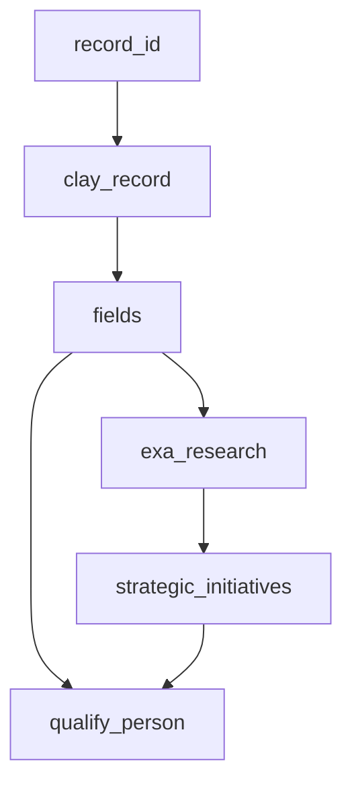

# Clay → Deepline Migration Skill

---

## ⚠️ Security: Cookie Isolation — Read First

Clay session cookies in `--with` args are sent to Deepline telemetry (`POST /api/v2/telemetry/activity`). `run_javascript` executes locally but the command string is transmitted.

**Two rules, always apply both:**

1. **Never embed the cookie in the payload.** Read it from env in JS:
   ```js
   'cookie': process.env.CLAY_COOKIE   // RIGHT
   'cookie': 'claysession=abc123'      // WRONG — appears in telemetry
   ```

2. **Store in `.env`, add to `.gitignore`:**
   ```bash
   # .env
   CLAY_COOKIE="claysession=<value>; ajs_user_id=<id>"
   ```
   Load with: `set -a; source .env; set +a`

---

## Input Forms

| Input type | What it contains | How to parse |
|---|---|---|
| **HAR file** (`app.clay.com_*.har`) | Full network traffic including `bulk-fetch-records` responses with rendered formula cell values — the richest input | Base64-decode + gunzip `response.content.text`; extract `results[].cells` |
| **ClayMate Lite export** (`clay-claude-t_xxx-date.json`) | `tableSchema` (raw GET response) + `portableSchema` ({{@Name}} refs) + `bulkFetchRecords` (N sample rows) — second richest input after HAR | Access `.tableSchema` for field IDs, `.bulkFetchRecords.results[].cells` for cell values, `.portableSchema.columns[].typeSettings` for portable action configs |
| **`GET /v3/tables/{ID}` JSON** | Schema only: field names, IDs, action types, column order. No cell values, no prompts | Use for column inventory and field ID→name mapping |
| **`POST bulk-fetch-records` response** | Schema + actual cell values for sampled rows — contains rendered formula prompts, action outputs, `NO_CELL` markers | `results[].cells[field_id].value` for each field |
| **Clay workbook URL** | Nothing directly — extract `TABLE_ID` from URL; fetch schema + records via API with user's `CLAY_COOKIE` | `GET /v3/tables/{TABLE_ID}` then `POST bulk-fetch-records` |
| **User description** | Column names + action types only — no field IDs, no actual prompts | Weakest input; must approximate everything |

**Priority order when multiple inputs available: HAR > ClayMate Lite export > bulk-fetch-records > schema JSON > user description.** Always use the richest available input. A ClayMate Lite export already bundles schema + records — use `.tableSchema` and `.bulkFetchRecords` from it directly.

**How to extract bulk-fetch-records from a HAR:**
```bash
# Find bulk-fetch-records entries (response body is base64+gzip)
python3 - <<'EOF'
import json, base64, gzip
with open('app.clay.com_ntop.har') as f:
    har = json.load(f)
for entry in har['log']['entries']:
    url = entry['request']['url']
    if 'bulk-fetch-records' in url:
        body = entry['response']['content'].get('text', '')
        enc  = entry['response']['content'].get('encoding', '')
        data = base64.b64decode(body) if enc == 'base64' else body.encode()
        try:
            data = gzip.decompress(data)
        except Exception:
            pass
        print(json.dumps(json.loads(data), indent=2)[:5000])
EOF
```

---

## Output Files

Every migration produces this structure:

```
project/
├── .env.example              # Required vars (CLAY_COOKIE, table IDs, etc.) — never .env itself
├── .gitignore                # Excludes .env, *.csv, work_*.csv
├── prompts/
│   └── <name>.txt            # One file per AI column. Header documents source:
│                             #   "# RECOVERED FROM HAR — field f_xxx"  ← verbatim from Clay
│                             #   "# ⚠️ APPROXIMATED — could not recover from HAR"  ← guessed
├── scripts/
│   ├── fetch_<table>.sh      # Fetches Clay records → seed_<table>.csv
│   └── enrich_<table>.sh     # Runs deepline enrich passes → output_<table>.csv
```

**Script output CSV columns:** All columns fetched from Clay (using exact field IDs) + one column per enrichment pass. Column names use `snake_case` aliases matching the pass plan.

**Prompt file format:** Plain text system prompt. Variables use `{{column_name}}` syntax (Deepline's interpolation). First line is always a `#` comment documenting the source (HAR field ID or approximation warning).

---

## Phase 1: Documentation (Always First)

Produce before writing any scripts. Get user confirmation before Phase 2.

### 1.1 — Table Summary

| # | Column Name | Clay Action | Tool/Model | Output Type | Notes |
|---|---|---|---|---|---|
| 1 | `record_id` | built-in | — | string | |
| … | | | | | |

### 1.2 — Dependency Graph (Mermaid)



Use `classDef` colors: blue = local (run_javascript), orange = remote API, green = AI (call_ai).

### 1.3 — Pass Plan

```markdown
| Pass | Column alias | Deepline tool | Depends on | Notes |
|---|---|---|---|---|
| 1 | clay_record | run_javascript (fetch) | record_id | Cookie from env |
| 2 | fields | run_javascript (flatten) | clay_record | |
| 5a | work_email_primary | cost_aware_first_name_and_domain_to_email_waterfall | first_name, last_name, company_domain | Primary — permutation+validation built-in |
| 5b | perm_fln | run_javascript | first_name, last_name, company_domain | fln pattern; MUST execute before 5c |
| 5c | valid_fln | leadmagic_email_validation | perm_fln (executed) | Accept valid OR catch-all |
| 5d | work_email_fallback | person_linkedin_to_email_waterfall | linkedin_url | LinkedIn fallback |
| 5e | work_email | run_javascript (merge) | 5a, 5b, 5c, 5d | primary ‖ fln ‖ fallback |
| 6 | email_valid | leadmagic_email_validation | work_email | Optional final gate |
| 7 | job_function | call_ai haiku | fields.job_title | |
| 8 | company_research | call_ai haiku + WebSearch | fields.company_domain | Pass 1 of 2 |
| 9 | strategic_initiatives | call_ai sonnet json_mode | company_research | Pass 2 of 2 |
| 10 | qualify_person | call_ai sonnet json_mode | person_profile, strategic_initiatives | ICP score 0-10 |
```

### 1.4 — Assumptions Log

State every unverifiable assumption. Get confirmation before Phase 2.

### 1.5 — HAR/bulk-fetch-records Prompt Extraction

**Do this before writing any prompt approximations.** Actual Clay prompt templates often live in formula field cell values in the bulk-fetch-records response.

**Discovery procedure:**
1. In the bulk-fetch-records response, look for `formula` type fields with cell values that start with "You are..." or contain numbered requirements — these are Clay's rendered prompt templates.
2. Check `action` type fields for actual cell values: if they contain `"Status Code: 200"` or `"NO_CELL"`, they are webhook calls or unfired actions — not AI outputs.
3. Any field whose value reads like prompt instructions (numbered requirements, tone description, example output) is the rendered prompt template — use it verbatim, noting the field ID.

**If actual prompts found:** Use them directly. Mark prompt files with `# RECOVERED FROM HAR — field f_xxx` header. Fix any Clay formula bugs (wrong field references, `{single_brace}` syntax that wasn't interpolated).

**If no HAR available:** Write approximated prompts, flag clearly with `# ⚠️ APPROXIMATED — could not recover from HAR` header.

### 1.6 — Pipeline Architecture Verification

Before assuming how many AI passes a pipeline has, check actual cell values across 3+ records:

| Cell value | Meaning | How to replicate |
|---|---|---|
| `NO_CELL` | Action never fired | Build from scratch |
| `"Status Code: 200"` / `{"status":200}` | HTTP/webhook action (n8n, Zapier) — NOT AI output | `run_javascript` fetch or stub |
| `""` (empty string) | Column ran but produced nothing, or was disabled | Treat as NO_CELL |
| Varied generation-shaped text | Actual AI output | `call_ai` |

A column in the schema may never have run. Always verify cell values before counting AI passes. An empty or "Status Code: 200" column is not a pipeline step.

---

## Phase 2: Pre-flight Checklist

Answer these **before writing scripts**. Wrong answers here cascade into wrong tool selection.

**Email strategy:**
- [ ] Does Clay table have `generate-email-permutations` OR `validate-email`? → **MUST use 3-pass approach (5a–5e).** Do not use `person_linkedin_to_email_waterfall` as primary.
- [ ] Does Clay use an enterprise email waterfall (wiza, hunter, findymail, etc.)? → Include `work_email_fallback` as pass 5d.
- [ ] What join key exists to match GT vs enriched output? (usually `full_name` or `record_id`)

**Dependency ordering:**
- [ ] Which columns are `run_javascript`? → These must execute before any column that references them via `{{col_name}}`.
- [ ] Are validation columns referencing computed JS values? → See [execution-ordering.md](references/execution-ordering.md).

**Cost / conditional execution:**
- [ ] Are fallback provider columns (person_linkedin_to_email_waterfall, etc.) only run on rows where cheaper stages failed? → Each paid stage should use `filter_missing → enrich subset → merge_back`. See [execution-ordering.md](references/execution-ordering.md).

**Security:**
- [ ] Is CLAY_COOKIE stored in `.env` (not hardcoded)? → Verify `.env` in `.gitignore`.
- [ ] Do all run_javascript fetch calls use `process.env.CLAY_COOKIE`?

If any email checkbox is YES and the script uses only individual providers (hunter_email_finder, etc.) with no permutation step → **stop and rewrite using the 3-pass approach.**

---

## Phase 2: Script Generation

**Two scripts per migration:**

**`clay_fetch_records.sh`** — Fetches Clay records via `run_javascript` + `fetch()`.
- `schema` mode: `GET /v3/tables/{id}` metadata
- `pilot` mode: `--rows 0:3`
- `full` mode: all rows

**`claygent_replicate.sh`** — Replicates AI + enrichment columns via `deepline enrich`.

**Cookie pattern (mandatory):**
```bash
set -a; source .env; set +a
: "${CLAY_COOKIE:?CLAY_COOKIE must be set in .env}"
```

**Python subprocess for JSON payloads (mandatory when JS code is in the payload):**
```bash
WITH_ARG=$(python3 - <<'PYEOF'
import json
code = "const fn=(row.first_name||'').toLowerCase()..."
print('col_name=run_javascript:' + json.dumps({'code': code}))
PYEOF
)
deepline enrich --input seed.csv --output work.csv --with "$WITH_ARG"
```
This avoids all bash/JSON quoting issues. Never hand-build JSON with embedded JS in bash strings.

**Execution ordering** — always follow the staged pattern:
1. Declare all independent columns → execute run_javascript first
2. Add validation/AI columns that reference JS output (--in-place) → execute
3. Add merge column (--in-place) → execute
4. Export

See [execution-ordering.md](references/execution-ordering.md) for the full pattern with polling loop.

---

## Clay Action → Deepline Tool Mapping

Full CLI patterns: [clay-action-mappings.md](references/clay-action-mappings.md). Always verify tool IDs before use.

| Clay action | Deepline tool |
|---|---|
| `generate-email-permutations` + entire email waterfall + `validate-email` | **`cost_aware_first_name_and_domain_to_email_waterfall`** (primary) + manual `perm_fln` + `leadmagic_email_validation` + `person_linkedin_to_email_waterfall` (fallback). See Pass Plan 5a–5e. **⚠️ `person_linkedin_to_email_waterfall` alone = ~13% match rate vs ~99% with permutation-first approach.** |
| `enrich-person-with-mixrank-v2` | `leadmagic_profile_search` → `crustdata_person_enrichment` |
| `lookup-company-in-other-table` | `run_javascript` (local CSV join) |
| `chat-gpt-schema-mapper` | `call_ai` haiku, no json_mode |
| `use-ai` (no web) | `call_ai` haiku or sonnet |
| `use-ai` (claygent + web) | Pass 1: `call_ai` haiku + WebSearch → Pass 2: `call_ai` sonnet (always 2 passes) |
| `octave-qualify-person` | `call_ai` sonnet + json_mode ICP scorer |
| `octave-run-sequence-runner` | Pass 1: `call_ai` haiku (signals) → Pass 2: `call_ai` sonnet (email) |
| `add-lead-to-campaign` (Smartlead) | `smartlead_api_request` POST /v1/campaigns/{id}/leads |
| `add-lead-to-campaign` (Instantly) | `instantly_add_to_campaign` |
| `exa_search` | `exa_search` (direct) |
| `social-posts-*` | `apify_run_actor_sync` (apimaestro/linkedin-profile-scraper) — omit unless requested |

---

## Critical Rules

- **Execution ordering**: `run_javascript` columns must be executed before adding `--in-place` columns that reference their values. See [execution-ordering.md](references/execution-ordering.md).
- **Conditional row execution**: Never run expensive paid columns (provider waterfalls, validation APIs) on rows where a cheaper stage already found the answer. Use the filter → enrich → merge pattern: after each "find" stage, filter to only rows still missing a value, then run the next stage on that subset only. See [execution-ordering.md](references/execution-ordering.md) for the full pattern. Free columns (`run_javascript`, `call_ai`) are exempt — always run on all rows.
- **Flatten first**: `fields=run_javascript:{flatten clay_record}` — required before any `{{fields.xxx}}` reference.
- **2-level max interpolation**: `{{col.field}}` works; `{{col.field.nested}}` fails. Flatten first.
- **json_mode output**: `call_ai` with `json_mode` outputs `{output, extracted_json}`. Reference downstream as `{{col.extracted_json}}`.
- **Separate passes for deps**: A column referenced by `{{xxx}}` must be in a prior enrich call.
- **Python subprocess for payloads**: Use `python3 -c "import json; print('col=tool:' + json.dumps({...}))"` — never hand-write JSON with embedded JS in bash strings.
- **Cookie in env**: Never embed `CLAY_COOKIE` value in code — always `process.env.CLAY_COOKIE`.
- **Catch-all is valid**: Accept `valid`, `valid_catch_all`, AND `catch_all` from `leadmagic_email_validation` — all three are as reliable as Clay's own ZeroBounce output. `valid_catch_all` is the highest-confidence version (engagement-confirmed, <5% bounce rate). Do NOT accept `unknown`.

See [pitfalls.md](references/pitfalls.md) for full error → fix table.

---

## Phase 3: Evaluation

After running the full pipeline, compare against Clay ground truth.

**Run the bundled comparison script:**
```bash
# Auto-detects clay_ prefixed columns → unprefixed mapping
python3 /path/to/skill/scripts/compare.py ground_truth.csv enriched.csv

# Or with explicit column mapping
python3 /path/to/skill/scripts/compare.py ground_truth.csv enriched.csv \
  --map '{"clay_final_email":"work_email","clay_job_function":"job_function"}'
```

### Accuracy Thresholds

| Column type | Pass threshold | How to check |
|---|---|---|
| Email (`work_email`) | DL found rate ≥ 95% of Clay found rate | compare.py auto-flags |
| Classify (`job_function`) | ≥ 95% exact match on pilot rows | compare.py distribution output |
| Structured (`call_ai` json_mode) | `extracted_json` present in 100% of rows, all schema fields populated | Spot-check 5 rows |
| Fetch (`run_javascript`) | 100% non-null for all mapped fields | compare.py fill rate |

### Accuracy Expectations (What "Found" Actually Means)

**Email accuracy is not 100% even at 99% match rate.** There are two categories:

1. **Confirmed deliverable**: LeadMagic returns `valid` or `valid_catch_all` → high confidence. `valid_catch_all` means engagement signal data confirmed the address on a catch-all domain (<5% bounce rate).
2. **Unverifiable catch-all**: Returns `catch_all` → domain accepts all addresses. The permutation format (fn.ln, fln) is a best guess. Same limitation as Clay (Clay uses the same ZeroBounce validation).
3. **Unknown**: Server no response → skip; do not treat as found.

This matches Clay's own accuracy characteristics — Clay uses the same ZeroBounce validation. If a user asks "is this 100% accurate?", the honest answer is: **same accuracy as Clay, which is high but not 100%** due to catch-all domains and format edge cases.

---

## Workflow

1. **Phase 1**: Table summary, dependency graph, pass plan, assumptions log
2. **Phase 2 pre-flight**: Complete checklist — especially email strategy verification
3. **Confirm**: Get user approval on assumptions
4. **Phase 2**: Generate `clay_fetch_records.sh` + `claygent_replicate.sh`
5. **Pilot gate**: Run `--rows 0:0` for any paid tools; show preview
6. **Full run**: After approval
7. **Phase 3**: `python3 compare.py ground_truth.csv enriched.csv` — confirm all thresholds pass

---

## Pilot Gate (before paid tools)

`run_javascript` and `call_ai` are free — no gate needed.
For `exa_search`, `leadmagic_*`, `hunter_*`, and other paid tools: run rows 0:0 first.

```bash
./claygent_replicate.sh           # pilot: row 0 only
./claygent_replicate.sh 0:3       # rows 0–3
./claygent_replicate.sh full      # all rows
```
