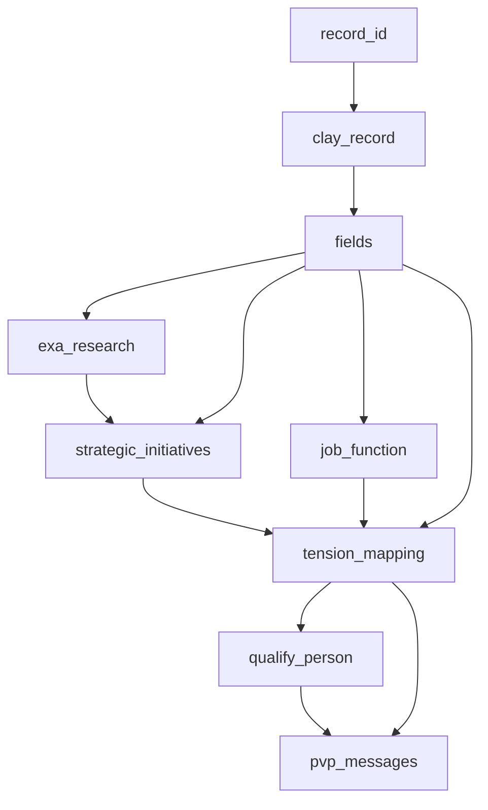

# Clay → Deepline Migration Skill

Convert Clay table configurations into reproducible Deepline enrichment scripts.

---

## ⚠️ Security: Cookie Isolation — Read First

Clay session cookies embedded in `--with` args **are included in Deepline's telemetry `command_text`** and transmitted to `POST /api/v2/telemetry/activity`. This was confirmed by tracing the CLI source.

**Data flow:**
```
CLAY_COOKIE in --with arg
  → deepline enrich (execution: local ✅, run_javascript is a local tool)
  → deepline enrich (telemetry: command_text sent remote ⚠️)
```

**Mitigations — always apply all three:**

1. **Never embed the cookie in the `--with` arg payload**. Instead, the `run_javascript` code must read it from an environment variable at runtime:
   ```js
   // WRONG — cookie sent to Deepline telemetry
   'cookie': 'claysession=abc123'

   // RIGHT — cookie never leaves the JS runtime env
   'cookie': process.env.CLAY_COOKIE
   ```

2. **Store the cookie in `.env`, never in the script file:**
   ```bash
   # .env  (add to .gitignore)
   CLAY_COOKIE="claysession=<value>; ajs_user_id=<id>"
   ```
   Load it in the script with:
   ```bash
   set -a; source .env; set +a
   ```

3. **Add `.env` to `.gitignore`** at the top of every generated script block:
   ```bash
   # ⚠️  NEVER commit .env — contains your Clay session cookie
   echo '.env' >> .gitignore
   ```

**What is safe:**
- `run_javascript` execution itself is fully local — payload never goes to Deepline's server
- `call_ai` is also a local tool — no Clay credentials involved
- `exa_search` payloads contain only search queries — no Clay credentials

---

## Input Forms

Accept any of:
- Clay table JSON (from `GET /v3/tables/{TABLE_ID}` or browser devtools export)
- Clay bulk-fetch-records JSON payload (POST response with `results[].cells`)
- Clay workbook URL (extract TABLE_ID from URL, user must provide session cookie)
- User description of their Clay table columns + action types

---

## Phase 1: Documentation (Always First)

Before writing any scripts, produce structured documentation of the Clay table. This is mandatory — it surfaces assumptions, confirms the dependency graph, and gives the user a reviewable artifact.

### 1.1 — Table Summary (Markdown)

```markdown
## Clay Table: <TABLE_NAME>

**Workbook ID:** `<workbook_id>`
**Table ID:** `<TABLE_ID>`
**Record count:** ~N rows
**Fetched via:** `GET /v3/tables/<TABLE_ID>` + `POST bulk-fetch-records`

### Columns

| # | Column Name | Clay Action | Tool/Model | Output Type | Notes |
|---|---|---|---|---|---|
| 1 | `record_id` | built-in | — | string | Clay record identifier |
| 2 | `full_name` | built-in | — | string | Contact full name |
| 3 | `clay_record` | `run_javascript` | fetch() | object | Raw bulk-fetch-records output |
| 4 | `fields` | `run_javascript` | flatten | object | Flattened clay_record subfields |
| 5 | `exa_research` | `use-ai` (claygent+web) | exa_search | string | Web research results |
| 6 | `strategic_initiatives` | `use-ai` (claygent) | sonnet, json_mode | object | Top company initiatives |
| 7 | `qualify_person` | `octave-qualify-person` | sonnet, json_mode | object | ICP score + tier |
```

### 1.2 — Dependency Graph (Mermaid)

Always produce a Mermaid diagram showing the data flow. Nodes = columns, edges = `uses →`.



Rules for the diagram:
- Dashed edges `-.->` for optional/soft dependencies
- Label each edge with the field referenced: `C --> D[exa_research]: fields.company_name`
- Group passes by color using `classDef`: local tools blue, remote tools orange, AI tools green

### 1.3 — Pass Plan

List every Deepline pass in topological order, with explicit dependency statements:

```markdown
## Deepline Pass Plan

| Pass | Column | Tool | Model | Depends on | Notes |
|---|---|---|---|---|---|
| 1 | `clay_record` | `run_javascript` (fetch) | — | record_id | Fetches raw Clay data via bulk-fetch-records API |
| 2 | `fields` | `run_javascript` (flatten) | — | clay_record | Extracts all subfields to top level |
| 3 | `exa_research` | `exa_search` | — | fields.company_name, fields.company_domain | Paid tool — pilot gate required |
| 4 | `job_function` | `call_ai` haiku | auto | fields.job_title | Simple classification |
| 5 | `strategic_initiatives` | `call_ai` sonnet | claude | fields, exa_research | json_mode — reference via .extracted_json |
| 6 | `qualify_person` | `call_ai` sonnet | claude | fields, strategic_initiatives.extracted_json | ICP score 0-10 |
```

### 1.4 — Assumptions Log

Explicitly state every assumption that cannot be verified from the input. Get user confirmation before Phase 2.

```markdown
## Assumptions (confirm before proceeding)

1. **Field IDs**: Using field names from Clay schema. If IDs differ, update `v()` calls in fetch script.
2. **Cookie scope**: Assumes standard Clay session cookie. Enterprise SSO cookies may have different names.
3. **Model mapping**: Clay `gpt-4.1` → Deepline `sonnet`. Confirm if a different tier is intended.
4. **ICP definition**: `octave-qualify-person` config not visible — reconstructed from column context. Confirm scoring rubric.
5. **Flattened fields**: `clay_record` subfield names assumed from field list. Verify against actual bulk-fetch response.
```

---

## Phase 2: Script Generation

Only begin after user confirms Phase 1 documentation.

### Two Output Scripts

Always produce exactly two scripts per migration:

**Script 1: `clay_fetch_records.sh`**
Replaces Clay API → `run_javascript` + `fetch()`. Cookie loaded from env, never hardcoded.
- `schema` mode: `GET /v3/tables/{id}` → run_javascript returning table metadata
- `pilot` mode: `POST bulk-fetch-records` for `--rows 0:3`
- `full` mode: all rows

**Script 2: `claygent_replicate.sh`**
Replicates each AI action column as a separate numbered pass in `deepline enrich --in-place`.

See [script-templates.md](references/script-templates.md) for boilerplate.

**Cookie pattern (mandatory in all generated scripts):**
```bash
# Load Clay credentials from .env — NEVER hardcode
set -a; source .env; set +a
: "${CLAY_COOKIE:?CLAY_COOKIE must be set in .env}"
```

In the run_javascript code string, access via `process.env.CLAY_COOKIE`:
```python
enrich_code = r"""return (async () => {
  const resp = await fetch(
    'https://api.clay.com/v3/tables/' + TABLE_ID + '/bulk-fetch-records',
    {
      method: 'POST',
      headers: {
        'cookie': process.env.CLAY_COOKIE,   // ← loaded from env, not embedded
        'content-type': 'application/json'
      },
      body: JSON.stringify({ recordIds: [recordId] })
    }
  );
  ...
})()"""
```

---

## Clay Action → Deepline Tool Mapping

Read [clay-action-mappings.md](references/clay-action-mappings.md) for the full mapping table.

| Clay action | Deepline equivalent | Notes |
|---|---|---|
| `run_javascript` | `run_javascript` | Direct — same JS, wrap in `(async () => {})()` |
| `use-ai` (no web) | `call_ai` haiku/sonnet | Match model to Clay model tier |
| `use-ai` (claygent + web) | `exa_search` pass → `call_ai` sonnet | Two separate passes |
| `chat-gpt-schema-mapper` | `call_ai` haiku | Simple classify, agent: "auto" |
| `octave-qualify-person` | `call_ai` sonnet, custom ICP prompt | See ICP scoring pattern |
| `exa_search` | `exa_search` | Native deepline tool |
| `score-your-data` | `call_ai` haiku scoring prompt | If unconfigured in Clay, build from ICP |

---

## Execution Order (Dependency Chain)

1. Start with `run_javascript` data-fetch columns (no deps)
2. Add `run_javascript` flatten pass for any multi-field objects
3. Add `exa_search` passes (no deps beyond flat fields)
4. Add `call_ai` passes in dependency order (refs must exist before use)
5. Add scoring/qualification pass last

---

## Critical Rules

- **Pass 1 is always a flatten**: `fields=run_javascript:{flatten clay_record}` — extracts `clay_record` subfields to top-level so downstream passes can reference `{{fields.xxx}}`
- **2-level max interpolation**: `{{col.field}}` works; `{{col.field.nested}}` fails. Flatten first.
- **json_mode wraps output**: `call_ai` with `json_mode` outputs `{output, extracted_json}`. Reference as `{{col.extracted_json}}`, not `{{col.field_name}}`
- **Separate passes for deps**: A column referenced by `{{xxx}}` must be in a prior enrich call, not the same one
- **Python subprocess for payloads**: Use `python3 -c "import json; print('col=tool:' + json.dumps({...}))"` to build `--with` args — avoids bash quoting issues with JSON
- **Cookie in env**: Never embed `CLAY_COOKIE` value in code — load from `.env` via `process.env.CLAY_COOKIE`

See [pitfalls.md](references/pitfalls.md) for full error → fix table.

---

## Phase 3: Evaluation (Column-by-Column Accuracy Check)

After scripts run, always produce an evaluation comparing Deepline output vs. original Clay data.

### 3.1 — Evaluation Script

Generate `eval_accuracy.sh` that:
1. Fetches 3–5 representative rows from Clay's bulk-fetch-records API (the ground truth)
2. Reads the same rows from the Deepline output CSV
3. Produces a side-by-side column comparison report

```bash
#!/usr/bin/env bash
# eval_accuracy.sh — compare Deepline output vs Clay ground truth
set -euo pipefail

DEEPLINE_CSV="./output/clay_records_enriched.csv"
EVAL_ROWS="0:4"   # rows to evaluate
REPORT="./output/eval_report.md"

python3 - <<'PYEOF'
import csv, json, subprocess, sys, os

DEEPLINE_CSV = "./output/clay_records_enriched.csv"
REPORT = "./output/eval_report.md"

# Load Deepline output
with open(DEEPLINE_CSV, newline="") as f:
    deepline_rows = list(csv.DictReader(f))[:5]

lines = ["# Evaluation Report — Clay vs Deepline Output\n"]
lines.append(f"Rows evaluated: {len(deepline_rows)}\n")

# Column-by-column comparison
# For each column, show: Clay original value | Deepline value | Match?

COLUMNS_TO_EVAL = [
    # (deepline_col, clay_field_id, description)
    ("fields", None, "Flattened record — spot-check key subfields"),
    ("job_function", "f_job_function_id", "Persona classification"),
    ("strategic_initiatives", "f_strategic_initiatives_id", "Company initiatives (json_mode)"),
    ("qualify_person", "f_qualify_person_id", "ICP score + tier"),
]

for row_i, row in enumerate(deepline_rows):
    lines.append(f"\n## Row {row_i}: {row.get('full_name', row.get('record_id', f'row_{row_i}'))}\n")
    lines.append("| Column | Clay Value | Deepline Value | Status |")
    lines.append("|---|---|---|---|")

    for dl_col, clay_field, desc in COLUMNS_TO_EVAL:
        dl_val = row.get(dl_col, "MISSING")

        # Try to parse JSON for structured columns
        if dl_val and dl_val.startswith("{"):
            try:
                parsed = json.loads(dl_val)
                if "extracted_json" in parsed:
                    dl_val = json.dumps(parsed["extracted_json"], ensure_ascii=False)[:200]
                else:
                    dl_val = json.dumps(parsed, ensure_ascii=False)[:200]
            except Exception:
                pass

        # Clay value — fetched separately and stored in eval_clay_ground_truth.json
        clay_val = "— (fetch manually)"
        if os.path.exists("./output/eval_clay_ground_truth.json"):
            with open("./output/eval_clay_ground_truth.json") as gtf:
                gt = json.load(gtf)
            row_gt = gt.get(str(row_i), {})
            if clay_field:
                clay_val = str(row_gt.get(clay_field, "NO_CELL"))[:200]

        status = "✅" if dl_val and dl_val not in ("MISSING", "null", "") else "❌ empty"
        lines.append(f"| `{dl_col}` | `{clay_val[:80]}` | `{str(dl_val)[:80]}` | {status} |")

    lines.append("")

with open(REPORT, "w") as f:
    f.write("\n".join(lines))

print(f"Eval report written to {REPORT}")
PYEOF
```

### 3.2 — What to Check Per Column Type

| Column type | Key checks |
|---|---|
| `run_javascript` fetch | All expected fields present, no `null` or `NO_CELL`, `record_id` matches |
| `run_javascript` flatten | Every field from `clay_record` accessible at top level in `fields` |
| `call_ai` haiku (classify) | Value is in expected enum (e.g. `"Engineering"`, `"Sales"`) — same as Clay label |
| `call_ai` sonnet json_mode | `extracted_json` key present, required JSON fields populated, no schema violations |
| `exa_search` | Non-empty string, contains relevant company/person keywords |
| `octave-qualify-person` equivalent | `score` is numeric 0–10, `tier` is A/B/C, `qualified` is boolean |

### 3.3 — Accuracy Thresholds

Before signing off on the migration:

- **Fetch columns** (`run_javascript`): 100% of rows must have non-null values for all mapped fields
- **Classify columns** (`call_ai` haiku): ≥95% match with Clay labels on pilot rows
- **Structured columns** (`call_ai` sonnet, json_mode): All required JSON schema fields present in 100% of rows
- **Qualification score** (`qualify_person`): Score distribution should roughly match Clay's Octave output (spot-check tier breakdown)

If any threshold is missed, consult [pitfalls.md](references/pitfalls.md) before rerunning.

---

## Workflow

1. **Phase 1 — Document**: Produce table summary, Mermaid dependency graph, pass plan, assumptions log
2. **Confirm with user**: Get approval on assumptions before writing any code
3. **Phase 2 — Generate scripts**: `clay_fetch_records.sh` + `claygent_replicate.sh` with cookie-safe pattern
4. **Pilot gate**: Run `--rows 0:0` first; show output preview
5. **Full run**: After approval, run full dataset
6. **Phase 3 — Evaluate**: Run `eval_accuracy.sh`, show column-by-column report, flag any misses

---

## Pilot Gate (mandatory before paid tools)

Before running any paid tool (exa_search), run `--rows 0:0` and show the ASCII preview.
`run_javascript` and `call_ai` are free — no gate needed.

```bash
./claygent_replicate.sh          # pilot: row 0 only
./claygent_replicate.sh 0:3      # rows 0-3
./claygent_replicate.sh full     # all rows
```
