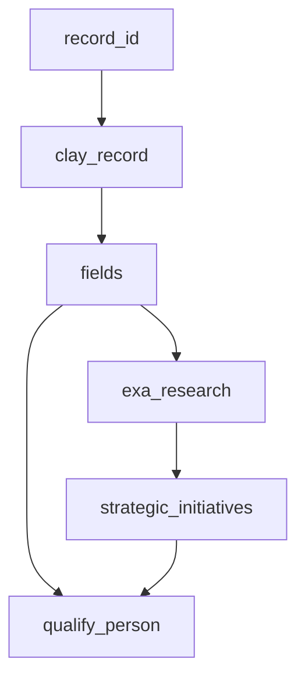

# Clay → Deepline Migration Skill

---

## ⚠️ Security: Cookie Isolation — Read First

Clay session cookies in `--with` args are sent to Deepline telemetry (`POST /api/v2/telemetry/activity`). `run_javascript` executes locally but the command string is transmitted.

**Two rules, always apply both:**

1. **Never embed the cookie in the payload.** Read it from env in JS:
   ```js
   'cookie': process.env.CLAY_COOKIE   // RIGHT
   'cookie': 'claysession=abc123'      // WRONG — appears in telemetry
   ```

2. **Store in `.env.deepline`, add to `.gitignore`:**
   ```bash
   # .env.deepline  (migration-specific — does not affect any other project env files)
   # Use SINGLE quotes — GA cookies contain $o7, $g1 etc. that bash expands with double quotes
   CLAY_COOKIE='claysession=<value>; ajs_user_id=<id>'
   ```
   Load with: `set -a; source .env.deepline; set +a`

   **How to get the cookie:** HAR exports strip `HttpOnly` cookies — `claysession` will be missing. Instead, copy a `curl` command from Chrome DevTools Network tab (right-click any api.clay.com request → Copy → Copy as cURL). Extract everything between `-b '...'` and store as `CLAY_COOKIE`.

---

## Input Forms

| Input type | What it contains | How to parse |
|---|---|---|
| **HAR file** (`app.clay.com_*.har`) | Full network traffic including `bulk-fetch-records` responses with rendered formula cell values — the richest input | Base64-decode + gunzip `response.content.text`; extract `results[].cells` |
| **ClayMate Lite export** (`clay-claude-t_xxx-date.json`) | `tableSchema` (raw GET response) + `portableSchema` ({{@Name}} refs) + `bulkFetchRecords` (N sample rows, or `null` if table was empty at export time) — second richest input after HAR | Access `.tableSchema` for field IDs, `.bulkFetchRecords.results[].cells` for cell values (if non-null), `.portableSchema.columns[].typeSettings.inputsBinding` for **full prompts and JSON schemas** — recoverable even when `bulkFetchRecords` is null |
| **`GET /v3/tables/{ID}` JSON** | Schema only: field names, IDs, action types, column order. No cell values, no prompts | Use for column inventory and field ID→name mapping |
| **`POST bulk-fetch-records` response** | Schema + actual cell values for sampled rows — contains rendered formula prompts, action outputs, `NO_CELL` markers | `results[].cells[field_id].value` for each field |
| **Clay workbook URL** | Nothing directly — extract `TABLE_ID` from URL; fetch schema + records via API with user's `CLAY_COOKIE` | `GET /v3/tables/{TABLE_ID}` then `POST bulk-fetch-records` |
| **User description** | Column names + action types only — no field IDs, no actual prompts | Weakest input; must approximate everything |

**Priority order when multiple inputs available: HAR > ClayMate Lite export > bulk-fetch-records > schema JSON > user description.** Always use the richest available input. A ClayMate Lite export already bundles schema + records — use `.tableSchema` and `.bulkFetchRecords` from it directly.

**When `bulkFetchRecords` is null:** Fall back to `portableSchema` for prompt and schema recovery:
- Full prompts: `.portableSchema.columns[].typeSettings.inputsBinding` → find `{name: "prompt"}` entry → `.formulaText`
- JSON schemas: same → find `{name: "answerSchemaType"}` → `.formulaMap.jsonSchema` (double-escaped string — `JSON.parse` twice)
- Conditional run logic: `.typeSettings.conditionalRunFormulaText` — convert to row-filter in Deepline
- Mark prompts as `# RECOVERED FROM PORTABLE SCHEMA — field f_xxx` (verbatim, not approximated)

**How to extract bulk-fetch-records from a HAR:**
```bash
# Find bulk-fetch-records entries (response body is base64+gzip)
python3 - <<'EOF'
import json, base64, gzip
with open('your-export.har') as f:  # replace with your HAR filename
    har = json.load(f)
for entry in har['log']['entries']:
    url = entry['request']['url']
    if 'bulk-fetch-records' in url:
        body = entry['response']['content'].get('text', '')
        enc  = entry['response']['content'].get('encoding', '')
        data = base64.b64decode(body) if enc == 'base64' else body.encode()
        try:
            data = gzip.decompress(data)
        except Exception:
            pass
        print(json.dumps(json.loads(data), indent=2)[:5000])
EOF
```

---

## Output Files

Every migration produces this structure:

```
project/
├── .env.deepline             # Clay credentials (never commit — add to .gitignore)
├── .env.deepline.example     # Template showing required vars — safe to commit
├── .gitignore                # Excludes .env.deepline, *.csv, work_*.csv
├── prompts/
│   └── <name>.txt            # One file per AI column. Header documents source:
│                             #   "# RECOVERED FROM HAR — field f_xxx"  ← verbatim from Clay
│                             #   "# ⚠️ APPROXIMATED — could not recover from HAR"  ← guessed
├── scripts/
│   ├── fetch_<table>.sh      # Fetches Clay records → seed_<table>.csv
│   └── enrich_<table>.sh     # Runs deepline enrich passes → output_<table>.csv
```

**Script output CSV columns:** All columns fetched from Clay (using exact field IDs) + one column per enrichment pass. Column names use `snake_case` aliases matching the pass plan.

**Prompt file format:** Plain text system prompt. Variables use `{{column_name}}` syntax (Deepline's interpolation). First line is always a `#` comment documenting the source (HAR field ID or approximation warning).

---

## Phase 1: Documentation (Always First)

Produce before writing any scripts. Get user confirmation before Phase 2.

### 1.1 — Table Summary

| # | Column Name | Clay Action | Tool/Model | Output Type | Notes |
|---|---|---|---|---|---|
| 1 | `record_id` | built-in | — | string | |
| … | | | | | |

### 1.2 — Dependency Graph (Mermaid)



Use `classDef` colors: blue = local (`run_javascript`), orange = remote API, green = AI (`deeplineagent`).

### 1.3 — Pass Plan

**Column alias rule:** Derive aliases from the actual Clay column name, snake_cased (e.g. "Work Email" → `work_email`, "Strategic Initiatives" → `strategic_initiatives`). The two structural aliases `clay_record` and `fields` are fixed — all others follow the Clay schema. Do NOT invent names from a memorized list.

```markdown
| Pass | Column alias | Deepline tool | Depends on | Notes |
|---|---|---|---|---|
| 1 | clay_record | run_javascript (fetch) | record_id | Cookie from env; alias is always clay_record |
| 2 | fields | run_javascript (flatten) | clay_record | alias is always fields |
| N | <clay_col_snake> | <see clay-action-mappings.md> | <prior passes> | Alias = snake_case(Clay column name) |
```

Example (illustrative — actual aliases must match your table's column names):

```markdown
| Pass | Column alias | Deepline tool | Depends on | Notes |
|---|---|---|---|---|
| 1 | clay_record | run_javascript (fetch) | record_id | |
| 2 | fields | run_javascript (flatten) | clay_record | |
| 3 | work_email | cost_aware_first_name_and_domain_to_email_waterfall | fields.first_name, fields.last_name, fields.company_domain | Primary |
| 4 | work_email_li | person_linkedin_to_email_waterfall | fields.linkedin_url | Fallback for rows where 3 returned empty |
| 5 | email_valid | leadmagic_email_validation | work_email | Optional final gate |
| 6 | job_function | deeplineagent | fields.job_title | Classification |
| 7 | company_research | deeplineagent or exa_search -> deeplineagent | fields.company_domain | Pass 1 of 2 |
| 8 | strategic_initiatives | deeplineagent + jsonSchema | company_research | Pass 2 of 2 |
| 9 | qualify_person | deeplineagent + jsonSchema | fields.*, strategic_initiatives | ICP score |
```

### 1.4 — Assumptions Log

State every unverifiable assumption. Get confirmation before Phase 2.

### 1.5 — HAR/bulk-fetch-records Prompt Extraction

**Do this before writing any prompt approximations.** Actual Clay prompt templates often live in formula field cell values in the bulk-fetch-records response.

**Discovery procedure:**
1. In the bulk-fetch-records response, look for `formula` type fields with cell values that start with "You are..." or contain numbered requirements — these are Clay's rendered prompt templates.
2. Check `action` type fields for actual cell values: if they contain `"Status Code: 200"` or `"NO_CELL"`, they are webhook calls or unfired actions — not AI outputs.
3. Any field whose value reads like prompt instructions (numbered requirements, tone description, example output) is the rendered prompt template — use it verbatim, noting the field ID.

**Prompt recovery priority (richest to weakest):**
1. **HAR** — bulk-fetch-records cell values rendered formula prompts verbatim. Use directly.
2. **ClayMate `portableSchema`** — `columns[].typeSettings.inputsBinding[name=prompt].formulaText` has the full prompt even when `bulkFetchRecords` is null. Mark as `# RECOVERED FROM PORTABLE SCHEMA — field f_xxx`.
3. **Approximated** — reverse-engineer from outputs or user description. Mark as `# ⚠️ APPROXIMATED — could not recover`.

**JSON schema recovery from portableSchema:**
```python
import json
for col in d['portableSchema']['columns']:
    if col['type'] == 'action':
        for inp in col['typeSettings'].get('inputsBinding', []):
            if inp['name'] == 'answerSchemaType':
                schema_raw = inp.get('formulaMap', {}).get('jsonSchema', '').strip('"')
                # Double-escaped: unescape \\" → " and \\n → \n, then parse
                schema_raw = schema_raw.replace('\\"', '"').replace('\\n', '\n').replace('\\\\', '\\')
                schema = json.loads(schema_raw)
```

**Fix any Clay formula bugs in recovered prompts:** Wrong field references (e.g., `{{@Name}}` should become `{{name}}`), `{single_brace}` syntax (not interpolated by Deepline), `Clay.formatForAIPrompt(...)` wrapper calls (strip, use field ref directly).

### 1.6 — Pipeline Architecture Verification

Before assuming how many AI passes a pipeline has, check actual cell values across 3+ records:

| Cell value | Meaning | How to replicate |
|---|---|---|
| `NO_CELL` | Action never fired | Build from scratch |
| `"Status Code: 200"` / `{"status":200}` | HTTP/webhook action (n8n, Zapier) — NOT AI output | `run_javascript` fetch or stub |
| `""` (empty string) | Column ran but produced nothing, or was disabled | Treat as NO_CELL |
| Varied generation-shaped text | Actual AI output | `deeplineagent` |

A column in the schema may never have run. Always verify cell values before counting AI passes. An empty or "Status Code: 200" column is not a pipeline step.

---

## Phase 2: Pre-flight Checklist

Answer these **before writing scripts** based on what Phase 1 revealed. Only answer the questions that apply to your table — not every table has email columns or AI passes.

**Table type (check all that apply):**
- [ ] Has person enrichment columns (LinkedIn lookup, profile data) → verify enrichment tool with `deepline tools search "person enrichment linkedin"`
- [ ] Has email finding columns → see Email strategy below
- [ ] Has AI generation columns (use-ai, claygent, octave) → see AI strategy below
- [ ] Has scoring/qualification columns → see Scoring below
- [ ] Has campaign push / CRM update columns → identify target platform, verify tool with `deepline tools search "<platform> add leads"`
- [ ] Has cross-table lookups → export linked table to CSV first
- [ ] **Is a company intelligence table** (source = Mixrank/company search, no `record_id` fetch step) → see Company Intelligence pipeline below

**Email strategy (only if table has email columns):**
- [ ] Does it have `generate-email-permutations` OR `validate-email`? → Use `cost_aware_first_name_and_domain_to_email_waterfall` as primary (permutation + validation built-in), not `person_linkedin_to_email_waterfall` alone.
- [ ] Does it have a LinkedIn URL column? → Add `person_linkedin_to_email_waterfall` as a fallback pass for rows that the primary approach missed.
- [ ] What column identifies a row? → This is your join key for merging enriched output back.

**AI strategy (only if table has use-ai / claygent / octave columns):**
- [ ] Are recovered prompts from HAR (Phase 1 §1.5)? → Use verbatim. Fix any `{single_brace}` bugs and wrong field refs.
- [ ] Was any AI column empty / `NO_CELL` / `"Status Code: 200"` (Phase 1 §1.6)? → Exclude it from the pass plan entirely.
- [ ] Does any AI pass do web research + generation? → Split into 2 passes (research first, generation second). Never combine.

**Scoring / qualification (only if table has scoring columns):**
- [ ] Were ICP criteria visible in the Clay table config or HAR? → Use them verbatim. Do NOT invent scoring dimensions.
- [ ] If no criteria visible → ask the user before writing a scoring prompt.

**Dependency ordering (all tables):**
- [ ] Which columns are `run_javascript`? → Must execute before any `--in-place` pass that references `{{col_name}}`.
- [ ] Are any paid columns (exa_search, email finders) only needed on rows where cheaper stages returned empty? → Use the filter → enrich subset → merge pattern.

**Company intelligence pipeline (only if `source` field is Mixrank/company-search):**
- [ ] `Find companies` / `source` field → Replace with `apollo_company_search` + optional `prospeo_enrich_company`. Ask user for original Mixrank filter criteria (location, size, industry, tech stack).
- [ ] `route-row` action columns → NOT replicable. Produce filtered output CSV instead; document destination table IDs for reference.
- [ ] Conditional run columns (check `conditionalRunFormulaText` in portableSchema) → implement as row-filter before each pass (skip rows that don't match condition).
- [ ] Before generating scripts, confirm with user: (1) how to provide seed company data, (2) row count / scope, (3) whether downstream table routing is needed.

**Security (all tables):**
- [ ] Is `CLAY_COOKIE` stored in `.env.deepline` (not hardcoded in the script)? → Verify `.env.deepline` in `.gitignore`.
- [ ] Is `output/` in `.gitignore`? → Output CSVs contain Clay record PII (names, emails, LinkedIn URLs).
- [ ] Do all `run_javascript` fetch calls use `process.env.CLAY_COOKIE`, not a hardcoded string?
- [ ] Does `.env.deepline` use **single quotes** for `CLAY_COOKIE`? GA cookie values contain `$` characters that bash expands with double quotes.
- [ ] Does your CSV have any legacy columns from a previous script version? → Document as legacy in a comment.

---

## Phase 2: Script Generation

**Two scripts per migration:**

**`clay_fetch_records.sh`** — Fetches Clay records via `run_javascript` + `fetch()`.
- `schema` mode: `GET /v3/tables/{id}` metadata
- `pilot` mode: `--rows 0:3` (rows 0-2)
- `full` mode: all rows

**`claygent_replicate.sh`** — Replicates AI + enrichment columns via `deepline enrich`.

**Architecture choice: `deepline enrich` CLI vs Python SDK**

For Claygent-heavy tables (multiple `use-ai (claygent+web)` columns), the validated pattern is a **pure Python script** that calls `deepline tools execute exa_search` for external research and `deepline tools execute deeplineagent` for AI synthesis. This approach:
- Avoids `deepline enrich` entirely for AI passes when the logic is easier to orchestrate in Python
- Enables true parallel execution with `ThreadPoolExecutor` across both rows and passes simultaneously
- Gives full control over retry logic, confidence gates, and conditional branching
- Is compatible with `{{field}}` interpolation only when accessing `clay_record` data directly in Python (`json.loads(row['clay_record'])`) rather than via `deepline enrich --in-place`

The `deepline enrich` CLI pattern (shown below) still applies for non-AI passes (`run_javascript`, email waterfall, provider lookups) and for simple single-column `deeplineagent` enrichments.

**Cookie pattern (mandatory):**
```bash
set -a; source .env.deepline; set +a
: "${CLAY_COOKIE:?CLAY_COOKIE must be set in .env.deepline}"
CLAY_VERSION="${CLAY_VERSION:-v20260311_192407Z_5025845142}"

# clay_curl wrapper — required for all Clay API calls (bare curl gets 401)
clay_curl() {
  curl -s --fail \
    -b "${CLAY_COOKIE}" \
    -H "accept: application/json, text/plain, */*" \
    -H "origin: https://app.clay.com" \
    -H "referer: https://app.clay.com/" \
    -H "x-clay-frontend-version: ${CLAY_VERSION}" \
    -H "user-agent: Mozilla/5.0 (Macintosh; Intel Mac OS X 10_15_7) AppleWebKit/537.36 (KHTML, like Gecko) Chrome/145.0.0.0 Safari/537.36" \
    "$@"
}
```

**⚠️ Security: Never hardcode `CLAY_COOKIE` as a literal value in the script — it will appear in logs, telemetry, and git history.** Read it from env only. Check your `.env.deepline` is in `.gitignore`. Check your `output/` directory (which contains Clay PII data) is also gitignored.

**Clay API endpoint facts (verified):**

| What you need | Correct endpoint | Notes |
|---|---|---|
| All record IDs | `GET /v3/tables/{TABLE_ID}/views/{VIEW_ID}/records/ids` | `GET /v3/tables/{TABLE_ID}/records/ids` returns `NotFound` — **view ID required** |
| View ID | `GET /v3/tables/{TABLE_ID}` → `.table.firstViewId` | Always fetch dynamically from schema |
| Fetch records | `POST /v3/tables/{TABLE_ID}/bulk-fetch-records` | Body: `{"recordIds": [...], "includeExternalContentFieldIds": []}` |
| Response format | `{"results": [{id, cells, ...}]}` | Key is `results`; record ID is `.id` (not `.recordId`) |
| Record IDs response | `{"results": ["r_abc", "r_def", ...]}` | Parse with `.get("results", [])` |

**Python subprocess for JSON payloads (mandatory when JS code is in the payload):**
```bash
WITH_ARG=$(python3 - <<'PYEOF'
import json
code = "const fn=(row.first_name||'').toLowerCase()..."
print('col_name=run_javascript:' + json.dumps({'code': code}))
PYEOF
)
deepline enrich --input seed.csv --output work.csv --with "$WITH_ARG"
```
This avoids all bash/JSON quoting issues. Never hand-build JSON with embedded JS in bash strings.

**Execution ordering** — always follow the staged pattern:
1. Declare all independent columns → execute run_javascript first
2. Add validation/AI columns that reference JS output (--in-place) → execute
3. Add merge column (--in-place) → execute
4. Export

See [execution-ordering.md](references/execution-ordering.md) for the full pattern with polling loop.

---

## Clay Action → Deepline Tool Mapping

Full CLI patterns: [clay-action-mappings.md](references/clay-action-mappings.md). Always verify tool IDs before use.

### Unknown Action Fallback — Required When Action Is Not in the Table

When you encounter a Clay action not listed below, **do not guess**. Run discovery:

```bash
# Step 1 — describe what the action does, search by intent
deepline tools search "<what the action does>"

# Step 2 — inspect the best candidate
deepline tools get <candidate_tool_id>

# Step 3 — if nothing found, fall back to deeplineagent
# Use deeplineagent with jsonSchema for structured outputs; split exa_search and synthesis for research-heavy work
```

**Discovery examples by Clay action type:**

| You see in Clay | Search query | Likely result |
|---|---|---|
| `enrich-person-with-*` | `deepline tools search "person enrich linkedin"` | `leadmagic_profile_search`, `crustdata_person_enrichment` |
| `find-email-*` | `deepline tools search "email finder"` | `hunter_email_finder`, `leadmagic_email_finder` |
| `verify-email-*` | `deepline tools search "email verify validate"` | `leadmagic_email_validation`, `zerobounce_email_validation` |
| `company-*` / `enrich-company-*` | `deepline tools search "company enrich"` | `apollo_enrich_company`, `prospeo_enrich_company` |
| `add-to-campaign-*` | `deepline tools search "add leads campaign"` | `instantly_add_to_campaign`, `smartlead_api_request` |
| `social-media-*` | `deepline tools search "linkedin posts scrape"` | `crustdata_linkedin_posts`, `apify_run_actor_sync` |
| Completely novel action | `deepline tools search "<verb> <noun from column name>"` | Use top result or `deeplineagent` fallback |

**When to use `deeplineagent` fallback**: If `deepline tools search` returns no relevant tools, or the action involves model judgment (classification, scoring, generation, summarization), use `deeplineagent`. Reconstruct the prompt from `portableSchema.inputsBinding[name=prompt].formulaText` or the cell values in `bulkFetchRecords`.

| Clay action | Deepline tool | Test status |
|---|---|---|
| `generate-email-permutations` + entire email waterfall + `validate-email` | **`cost_aware_first_name_and_domain_to_email_waterfall`** (primary) + manual `perm_fln` + `leadmagic_email_validation` + `person_linkedin_to_email_waterfall` (fallback). See Pass Plan 5a–5e. **⚠️ `person_linkedin_to_email_waterfall` alone = ~13% match rate vs ~99% with permutation-first approach.** CLI syntax: `deepline enrich --input seed.csv --output out.csv --with '{"alias":"email_result","tool":"cost_aware_first_name_and_domain_to_email_waterfall","payload":{"first_name":"{{first_name}}","last_name":"{{last_name}}","domain":"{{domain}}"}}'` — the play expansion is previewed before running and the waterfall stops early once a valid email is found. | ✅ Tested — found `patrick.valle@zoominfo.com` (status=valid) via dot pattern on first try; 7 downstream providers skipped |
| `enrich-person-with-mixrank-v2` | `leadmagic_profile_search` → `crustdata_person_enrichment` | Not yet tested against real Clay Mixrank output |
| `lookup-company-in-other-table` | `run_javascript` (local CSV join) | Not yet tested |
| `chat-gpt-schema-mapper` | `deeplineagent`; add `jsonSchema` when you need structured extraction | ✅ Tested (analogous to `data_warehouse` + `job_function` passes) |
| `use-ai` (no web) | `deeplineagent` | ✅ Tested (data_warehouse, job_function, technical_resources_readiness, key_gtm_friction passes) |
| `use-ai` (claygent + web) | **Binary search optimizer** — Pass 1: 3× parallel `exa_search` (highlights-only, ~10x cheaper) targeting financial/IR, product launches, new segments → Pass 2: `deeplineagent` synthesis with `jsonSchema` containing `confidence: "high\|medium\|low"` and `missing_angles: [...]` → **Binary gate**: only if `confidence != "high"`: Pass 3a targeted follow-up exa searches on `missing_angles` → Pass 3b: re-synthesize → Pass 3c: primary-source deep-read (IR site, newsroom, official blog — scored by domain type) with `text: true` → final synthesis. Tracks `research_confidence` and `research_passes` columns. | ✅ Tested — 26 rows, side-by-side vs Clay traces (see empirical results in Phase 3) |
| `octave-qualify-person` | `deeplineagent` + `jsonSchema` ICP scorer | ✅ Tested — 26 rows |
| `octave-run-sequence-runner` | Pass 1: `deeplineagent` (signals) → Pass 2: `deeplineagent` (email) | Pattern tested (find_tension_mapping + verified_pvp_messages); not yet validated against a real sequence-runner Clay column |
| `add-lead-to-campaign` (Smartlead) | `smartlead_api_request` POST /v1/campaigns/{id}/leads | Not yet tested |
| `add-lead-to-campaign` (Instantly) | `instantly_add_to_campaign` — use `deepline tools execute instantly_add_to_campaign --payload '{"campaign_id":"<id>","contacts":[{"email":"...","first_name":"...","last_name":"...","company":"..."}]}'`. List campaigns first with `instantly_list_campaigns`. | ✅ Tested — `{"pushed": 1, "failed": 0, "errors": []}` |
| `exa_search` | `exa_search` (direct) | ✅ Tested extensively — highlights-only and full-text modes, include_domains |
| `route-row` | **Not replicable in Deepline.** Clay's routing action pushes rows to downstream tables conditionally. Replace with: produce a filtered output CSV per destination. Note destination `tableId` values from `inputsBinding` so user knows where data was going. | N/A — produces output CSV instead |
| `find-lists-of-companies-with-mixrank-source` (source type) | **Pass 1**: `apollo_company_search` (location, size, industry, tech stack filters) → **Pass 2** (optional): `prospeo_enrich_company` (description, industry, employee count). Ask user for original Mixrank filter criteria. See [clay-action-mappings.md](references/clay-action-mappings.md) Company Source section. | ✅ apollo_company_search tested |
| `social-posts-*` | Two separate tools: (1) **Profile post scraper** → `apify_run_actor_sync` (apimaestro/linkedin-profile-scraper) for fetching posts from a specific person's profile. (2) **Content search/signal monitoring** → `crustdata_linkedin_posts` (requires `keyword` field + optional `filters` for `MEMBER`, `COMPANY`, `AUTHOR_COMPANY`, etc.) — this is a keyword search, NOT a profile URL scraper. Use (1) for Clay's `social-posts-person` action; use (2) for signal monitoring (e.g., "who at ZoomInfo is posting about GTM?"). | ✅ `crustdata_linkedin_posts` keyword search tested; `apify_run_actor_sync` profile scraper not yet validated end-to-end |

---

## Binary Search Optimizer (Claygent Web Research Pattern)

Use whenever replicating a `use-ai (claygent + web)` column. Full pattern, pass structure, `_extract_primary_source_url()` implementation, confidence calibration data, failure modes, and search angle variants: **[binary-search-optimizer.md](references/binary-search-optimizer.md)**

**Summary:** Pass A: 3× parallel `exa_search` (highlights-only, domain-quoted queries) → Pass B: `deeplineagent` synthesis with `jsonSchema` containing `confidence` + `missing_angles` → **gate**: if `confidence == "high"` stop → Pass C: follow-up searches on `missing_angles` → Pass D: re-synthesize → Pass E: primary-source deep-read via `_extract_primary_source_url(company_domain=domain)`.

Always add `research_confidence` and `research_passes` tracking columns. `low` confidence ≠ bad output (26-row test: 0% high, 35% medium, 65% low — but 50% of `low` rows had specific useful content).

---

## Critical Rules

- **Execution ordering**: `run_javascript` columns must be executed before adding `--in-place` columns that reference their values. See [execution-ordering.md](references/execution-ordering.md).
- **Conditional row execution**: Never run expensive paid columns (provider waterfalls, validation APIs) on rows where a cheaper stage already found the answer. Use the filter → enrich → merge pattern: after each "find" stage, filter to only rows still missing a value, then run the next stage on that subset only. See [execution-ordering.md](references/execution-ordering.md) for the full pattern. Local `run_javascript` columns are exempt — always run them on all rows.
- **Flatten first** (CLI pattern): `fields=run_javascript:{flatten clay_record}` — required before any `{{fields.xxx}}` reference when using `deepline enrich --in-place`. **Not required when using the Python SDK approach** — just call `json.loads(row['clay_record'])` directly in Python and access any key.
- **2-level max interpolation**: `{{col.field}}` works; `{{col.field.nested}}` fails. Flatten first (CLI) or go multi-level in Python.
- **`MAX_LONG` cap warning**: If you add a row-count cap for expensive downstream passes (e.g. `row_range_long = row_range[:20]`), make sure to document this explicitly — it's easy to miss that some batches silently skip rows beyond the cap on a `full` run.
- **Always use structured JSON for `deeplineagent`**: Make a **single** `deeplineagent` invocation per column and extract all needed fields from one structured response. Never make multiple model calls where one `jsonSchema` output would suffice. Example: `qualify_person` should return one JSON object with `score`, `tier`, and `reasoning` — not three separate calls.
- **Structured output access**: `deeplineagent` with `jsonSchema` stores the object directly in the cell. Reference downstream flat fields as `{{col.field_name}}`. If you need deeper nesting than one object level, flatten it first with `run_javascript`.
- **Separate passes for deps**: A column referenced by `{{xxx}}` must be in a prior enrich call.
- **Python subprocess for payloads**: Use `python3 -c "import json; print('col=tool:' + json.dumps({...}))"` — never hand-write JSON with embedded JS in bash strings.
- **Cookie in env**: Never embed `CLAY_COOKIE` value in code — always `process.env.CLAY_COOKIE`.
- **Catch-all is valid**: Accept `valid`, `valid_catch_all`, AND `catch_all` from `leadmagic_email_validation` — all three are as reliable as Clay's own ZeroBounce output. `valid_catch_all` is the highest-confidence version (engagement-confirmed, <5% bounce rate). Do NOT accept `unknown`.

See [patterns.md](references/patterns.md) for prescriptive patterns + antipatterns for every common mistake.

---

## Phase 3: Evaluation

After running the full pipeline, compare against Clay ground truth.

**Run the bundled comparison script:**
```bash
# Auto-detects clay_ prefixed columns → unprefixed mapping
python3 /path/to/skill/scripts/compare.py ground_truth.csv enriched.csv

# Or with explicit column mapping
python3 /path/to/skill/scripts/compare.py ground_truth.csv enriched.csv \
  --map '{"clay_final_email":"work_email","clay_job_function":"job_function"}'
```

### Accuracy Thresholds

| Column type | Pass threshold | How to check |
|---|---|---|
| Email (`work_email`) | DL found rate ≥ 95% of Clay found rate | compare.py auto-flags |
| Classify (`job_function`) | ≥ 95% exact match on pilot rows | compare.py distribution output |
| Structured (`deeplineagent` + `jsonSchema`) | Object present in 100% of rows, all schema fields populated | Spot-check 5 rows |
| Fetch (`run_javascript`) | 100% non-null for all mapped fields | compare.py fill rate |
| Claygent/web research (`exa_search` + `deeplineagent`) | `is_failed_research()` returns False on ≥ 85% of rows | See confidence calibration section |

### Empirical results from 26-row production test (March 2026)

**Company mix**: ZoomInfo, Klaviyo, PetScreening, PulsePoint, Tines, Bloomreach, Aviatrix, BambooHealth, Circle, ZipHQ, Edmentum, PandaDoc, project44, Apollo GraphQL, Digital Turbine, Amagi, Stash, ConstructConnect, Momentive Software, and others.

| Metric | Value |
|---|---|
| Total rows | 26 |
| All 3 passes fired | 26/26 (100%) |
| Confidence: high | 0/26 (0%) |
| Confidence: medium/medium-high | 9/26 (35%) |
| Confidence: low (but useful content) | 13/26 (50%) |
| Failed (UNCHANGED/UNRESOLVED) | 4/26 (15%) |
| Score: Tier B (5–6) | 14/26 (54%) |
| Score: Tier C (0–4) | 12/26 (46%) |

**Clay vs Deepline content comparison (ZoomInfo, Patrick Valle):**
- Clay: `confidence=high`, 10 search steps, 133.75s, $0.13 cost, queries Google
- Deepline: `confidence=low` (despite specific accurate content), 3 passes, parallel execution, ~$0.02–0.05 cost, queries Exa
- Content quality: equivalent — both surface the ZI→GTM ticker rebranding, AI platform expansion, and international data initiatives. Deepline output is more recent (includes 2025 10-K filed Feb 2026 vs Clay's older run).

**Companies that reliably reach medium confidence**: Large public companies (ZoomInfo, Klaviyo, Circle), well-funded startups with active newsrooms (Tines, Aviatrix, project44), and companies with recent PR activity (PandaDoc, BambooHealth, Digital Turbine, Amagi, Onit).

**Companies that stay low**: Small niche B2B (LERETA, ConstructConnect, ZipHQ, Edmentum), companies with ambiguous domain names (getflex.com, onit.com, stash.com), private equity-owned businesses with sparse web presence.

### Accuracy Expectations (What "Found" Actually Means)

**Email accuracy is not 100% even at 99% match rate.** There are two categories:

1. **Confirmed deliverable**: LeadMagic returns `valid` or `valid_catch_all` → high confidence. `valid_catch_all` means engagement signal data confirmed the address on a catch-all domain (<5% bounce rate).
2. **Unverifiable catch-all**: Returns `catch_all` → domain accepts all addresses. The permutation format (fn.ln, fln) is a best guess. Same limitation as Clay (Clay uses the same ZeroBounce validation).
3. **Unknown**: Server no response → skip; do not treat as found.

This matches Clay's own accuracy characteristics — Clay uses the same ZeroBounce validation. If a user asks "is this 100% accurate?", the honest answer is: **same accuracy as Clay, which is high but not 100%** due to catch-all domains and format edge cases.

---

## Workflow

1. **Phase 1**: Table summary, dependency graph, pass plan, assumptions log
2. **Phase 2 pre-flight**: Complete checklist — especially email strategy verification
3. **Confirm**: Get user approval on assumptions
4. **Phase 2**: Generate `clay_fetch_records.sh` + `claygent_replicate.sh`
5. **Pilot gate**: Run `--rows 0:1` for any paid tools; show preview
6. **Full run**: After approval
7. **Phase 3**: `python3 compare.py ground_truth.csv enriched.csv` — confirm all thresholds pass

---

## Pilot Gate (before paid tools)

`run_javascript` needs no pilot gate.
For `deeplineagent`, `exa_search`, `leadmagic_*`, `hunter_*`, and other non-trivial or paid tools: run rows 0:1 first.

```bash
./claygent_replicate.sh           # pilot: row 0 only
./claygent_replicate.sh 0:3       # rows 0-2
./claygent_replicate.sh full      # all rows
```
