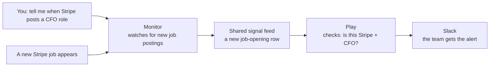

# Deepline Monitors

Monitors are **access-gated Deepline-native signal feeds**. The customer launch
includes Company Radar and Contact Radar. A monitor provisions a Deepline-managed
feed; events land in a Customer DB table. There is **no run to kick off** — it
streams as events arrive.

## The job: turn a future signal into a useful decision

A monitor is not a dashboard setting. It is a promise that a future real-world
event will reach the right workflow. Earn that trust: show the route, give a
small piece of evidence now, prove the stored definition says what was asked,
then let live events validate delivery over time. Each step answers a different
question; do not pretend one proves all four.

## Step 0 — access gate (do this first)

Monitors are an access-gated beta. Before any monitor command, confirm access:

```bash
deepline monitors status --json
```

- **You have access** → proceed.
- **No access** → stop. Do not run other monitor commands; tell the user to
  contact the Deepline team to request access.

The response is `{ "has_access": boolean, "reason": string }`; branch on
`has_access`. Other failures need diagnosis, not reinterpretation as rollout
denial.

## Start with the customer story

Before commands, show this picture with the customer's company, signal, and
destination substituted in. Lead with what becomes possible, not with schemas
or command names.



Say it plainly: **the monitor keeps watch. When it sees a new matching job, it
adds that job to the shared signal feed. That new row wakes the Play. The Play
checks the details we care about, then sends the Slack message.** The same Play
could instead update a CRM, create a task, or enrich the company.

The important boundary is that a monitor does not itself send Slack messages,
and it does not create a private channel for one workflow. Several monitors can
write to the same feed; each Play decides which new rows deserve action. That
keeps one useful source of truth, but a Play filter controls downstream action
only, not monitor ingestion cost.

## First proof of value: one filtered monitor

Do not make a customer wait days to discover whether the intended filter took
effect. Start with one narrow monitor and prove the stored definition after the
requested write. This is the fastest feedback loop and guards against false success.

**Example outcome:** “Tell me when Stripe posts a Chief Financial Officer job,
then let a Play react.” Read the live tool contract before using this example.

### Optional: test the closest real signal

Offer a small live probe when it helps the customer decide whether to deploy.
Do not make every monitor pretend it has one. A credible proxy has the same
**thing** (job, job change, review, post) and the same **moment** (new or
current) as the monitor. An adjacent lookup can be useful research, but it is
not evidence that the monitor will fire.

| Monitor is watching for…                             | Find a credible probe with…                                                 | Do not mistake this for…      |
| ---------------------------------------------------- | --------------------------------------------------------------------------- | ----------------------------- |
| Job postings                                         | `deepline tools search "job postings" --json`                               | A people or title search      |
| A tracked contact changing jobs                      | `deepline tools search "job change" --json`                                 | The contact's current profile |
| A provider webhook, campaign event, or website visit | The connected provider's test event or a deliberate test visit after deploy | A separate provider REST read |
| Any other signal                                     | `deepline tools search "<signal in plain English>" --json`                  | A loosely related enrichment  |

Read the shortlisted tool's live contract and price. Only run a one-result or
one-event probe after the customer approves its cost. Prefer the same provider
as the monitor when it exposes a callable read/search surface; otherwise say
that no faithful preflight exists instead of inventing one.

A successful current-data probe answers “does this filter find the kind of
thing we mean today?” Read its identifying fields, date, and URL before saying
it matched. An empty result says only that this search found nothing now. It
cannot prove that a future monitor will never deliver an event. The durable
proof remains: deploy, read back the stored definition, then observe a real
matching event reach the Play.

Do not execute a monitor type as though it were an on-demand search. In
particular, do not substitute a people search for a job-posting or job-change
test: it answers a different customer question.

### Every monitor gets a customer-reviewable preview

Never leave the customer with only a definition JSON. Give them one of these
three review artifacts and label it honestly:

1. **Current signal sample.** A one-result probe from a matching callable
   source, when one exists. This is real data now, not a delivery guarantee.
2. **Event contract card.** The `outputs` from `monitors check` or
   `deploy --dry-run` name the stream, table, and fields a future event will
   contain. Translate that into a short customer-facing card: “a new job will
   have a title, company, URL, and posting date.” This is an expected shape,
   not an observed event.
3. **Safe callback diagnostic.** After the customer has approved deployment,
   `monitors get <key> --json` may return `sample_payload`. Run it through the
   deployed monitor without writing a row or waking a Play:

   ```bash
   deepline monitors test <key> '<sample_payload from monitors get>' --json
   ```

   The result should say `accepted: true`, `test_mode: validation_only`,
   `persisted_rows: 0`, and `dispatched_bound_plays: 0`. Show the returned
   `preview_payload` to the customer. It proves Deepline accepts that event
   shape against this monitor's real binding; it does not prove the upstream
   provider emitted it.

For a monitor without `sample_payload`, use its connected provider's own test
event after deployment, then read the resulting row and Play delivery health.
Do not fabricate a provider webhook body just to fill the gap. `monitors test
--dispatch` writes rows and can wake Plays, so use it only when the customer has
explicitly approved a real end-to-end test.

```bash
# Learn the live job-opening payload fields, output stream, and event price.
deepline tools get deepline_native.company_job_openings --json
MONITOR='{
  "key": "stripe-cfo-job-openings",
  "name": "Stripe CFO job openings",
  "tool": "deepline_native.company_radar",
  "payload": {
    "domain": "stripe.com",
    "radar_type": "company_job_openings",
    "job_titles": "\"Chief Financial Officer\""
  }
}'
# These are safe. They validate the exact definition and show cost/reuse.
deepline monitors check "$MONITOR" --json
deepline monitors deploy --dry-run "$MONITOR" --json
# After showing scope, shared-stream impact, and price:
deepline monitors deploy "$MONITOR" --json
deepline monitors get stripe-cfo-job-openings --json
```

The proof is the final `get`, not the deploy response: it must show
`definition.payload.job_titles` as `"Chief Financial Officer"`, the expected
domain/radar type, and `status: active`. If any intended field differs, report a
failed write. Do not wait for events to infer the filter.

For a requested filter change, use the same tight loop:

```bash
deepline monitors update stripe-cfo-job-openings \
  '{"payload":{"job_titles":"\"Chief Financial Officer\" OR \"VP Finance\""}}' --json
deepline monitors get stripe-cfo-job-openings --json
```

When managing a fleet, prove this loop on one monitor first. Keep workers
bounded and save each requested patch/read-back result. A
`provider_monitor_control_state_conflict` (HTTP 409) means another writer changed
the monitor first: read it again and retry only if needed. Never treat a 409 as
success or retry it blindly.

## Find monitor types and read their filters

Monitor types live on the `tools` surface, alongside every other capability.
Browse them, then read one type's exact filters + stream columns:

```bash
# Browse the monitor types you can deploy
deepline tools list --categories monitors
deepline tools search "company radar"

# Read one specific monitor variant's full contract
deepline tools get deepline_native.company_job_openings
```

(`deepline monitors available [tool-id]` is a legacy alias for the same
discovery — prefer `tools`.)

The contract for a type gives you everything you need to deploy and to filter:

- **payload_schema** — the deploy-time filters you set in the monitor `payload`
  (typed: required fields, allowed values).
- **stream columns** — the row fields a play filters on with `sqlListeners.where`
  (the post-ingestion filter surface).
- **pricing** — Deepline credits per accepted event.
- **a deploy example** — `deepline monitors deploy '<def>'`.

A monitor type is deployed, not executed: `deepline tools execute <monitor-type>`
is rejected and points you at `deepline monitors deploy`.

## Command set

All commands accept `--json` (also automatic when stdout is piped).

| Command                                                             | What it does                                                                                                                                                                                                                                                                                                                                                       |
| ------------------------------------------------------------------- | ------------------------------------------------------------------------------------------------------------------------------------------------------------------------------------------------------------------------------------------------------------------------------------------------------------------------------------------------------------------ |
| `deepline monitors status`                                          | Report whether you have monitor access (`has_access`). **Run first.**                                                                                                                                                                                                                                                                                              |
| `deepline tools list --categories monitors` / `tools get <tool-id>` | **Preferred** discovery. Browse the monitor types you can deploy, and read one type's payload schema + stream columns + pricing. See "Find monitor types and read their filters".                                                                                                                                                                                  |
| `deepline monitors available [tool-id]`                             | Legacy alias of the `tools` discovery above (still works). Read-only; `--full` or a tool id for one type's full contract.                                                                                                                                                                                                                                          |
| `deepline monitors check '<definition>'`                            | Validate a monitor definition without deploying. Read-only; spends nothing. Also accepts `--file <path>` or `--file -` (stdin).                                                                                                                                                                                                                                    |
| `deepline monitors deploy '<definition>'`                           | Deploy a monitor (positional JSON, `--file <path>`, or `--file -`). Mutates workspace state and may spend Deepline credits. `--dry-run` shows the plan (validity, deploy cost in Deepline credits, existing monitors that may already cover the scope) without deploying.                                                                                          |
| `deepline monitors list`                                            | List the monitors you HAVE deployed. `--status active\|disabled\|all` (default `active`), `--limit`, `--cursor`, `--compact`. Response carries `total` (true registry count, not the page size), `returned`, `is_truncated`, and `next_cursor`. When `is_truncated` is true, page with `--cursor <next_cursor>` until it is false — see "Reuse before you deploy." |
| `deepline monitors get <key>`                                       | Show one deployed monitor by its public key. Read-only.                                                                                                                                                                                                                                                                                                            |
| `deepline monitors update <key> '<patch>'`                          | Update a deployed monitor (`<patch>` is a JSON object of fields; also `--file`).                                                                                                                                                                                                                                                                                   |
| `deepline monitors delete <key>`                                    | Delete a deployed monitor. Deprovisions the upstream resource by default; `--local-only` removes just the Deepline record. Prompts y/N in a terminal; non-interactive runs must pass `--yes`. `--dry-run` previews the plan.                                                                                                                                       |
| `deepline monitors reactivate <key>`                                | Reactivate a previously disabled deployed monitor. May spend Deepline credits; `--dry-run` shows the cost first.                                                                                                                                                                                                                                                   |

## Monitors as code (SDK)

The CLI and SDK use the same monitor model. Use the typed SDK in scripts, agent
loops, or play repositories. Read
[`../references/monitor-sdk.md`](../references/monitor-sdk.md); this recipe's
access, cost visibility, read-back, shared-stream, and pricing rules still apply.

## Recover from errors

Monitor errors return an actionable next step — follow it before retrying.

- **Transient / not ready yet**: wait briefly, then retry the same read or check
  once.
- **Unknown monitor type**: re-browse the catalog
  (`deepline tools list --categories monitors`) and pick a valid tool id. A
  missing _deployed_ monitor instead → `deepline monitors list --status all`.
- **Validation errors**: fix every reported field and rerun `monitors check`.
- **Not enough credits**: report the required credits, balance, and shortfall,
  then stop and ask the user to add Deepline credits.
- **Settlement / cleanup failure**: inspect the monitor state and report that
  repair is needed; don't blindly repeat the mutation.

A monitor suspended for insufficient credits stays disabled until you explicitly
reactivate it. Ask the user to add credits, run `monitors reactivate <key>
--dry-run`, show the impact summary, then reactivate when they ask. While
suspended, connected plays do not run.

**Edit existing monitors; do not delete and recreate them manually.**
`deepline monitors update <key> '<patch>'` and `client.monitors.update(key,
patch)` are the supported filter-edit paths. A changed definition keeps the
public monitor key and existing Customer DB rows, but the current provider
lifecycle may replace the upstream resource by creating the new resource before
deleting the previous one. Describe this as an update with upstream replacement,
not as a requirement to delete every monitor and start over.

**Reuse before you deploy.** `deepline monitors deploy` re-provisions an upstream
provider feed and spends credits. Before deploying, run
`deepline monitors list --status all` and check whether a monitor already
**covers your need**: same `tool`, watching the same scope. If a matching monitor
exists, do NOT deploy another — a play binds to the shared per-tool **stream**,
and may react to rows from every monitor feeding it. Reuse the existing monitor
and add a `sqlListeners.where` filter when the play needs narrower behavior. Do
not deploy another monitor expecting it to create an isolated play channel. A
disabled-but-matching monitor → `deepline monitors reactivate <key>`, not a
fresh deploy.

> **The reuse check must see the WHOLE registry, or it is worthless.** The list
> response reports `total` (the true registry count for the status filter),
> `returned`, and `is_truncated`. If `is_truncated` is `true`, you are looking at
> a partial page — a "no matching monitor" conclusion off a truncated page is how
> a duplicate paid monitor gets deployed onto an already-covered stream. Either
> raise `--limit` above `total`, or page with the returned `next_cursor`
> (`deepline monitors list --status all --cursor <next_cursor> --json`) until
> `is_truncated` is `false` and `next_cursor` is `null`. Only then is "no match"
> trustworthy.

## Shared streams and downstream blast radius

A deployed monitor is not an isolated trigger channel. It writes provider events
into a shared Customer DB stream/table. Public `sqlListeners` bindings subscribe
to a `tool` and `stream`, not to one monitor key, so a play may react to rows from
every monitor feeding that stream. Deploying another monitor on the same stream
does not create an isolated channel for its events.

Before creating, updating, disabling, reactivating, or deleting a monitor:

1. Read its output streams with `deepline tools get <tool-id> --json` (type-level
   `streams[]`) or `monitors get <key> --json` (a deployed instance).
2. Run `monitors list --status all --json` and inspect other monitors using the
   same tool and stream.
3. Inspect the dependent published plays returned by `monitors get`.
4. Explain whether the mutation will add rows, stop rows, or change which rows
   enter the shared table.
5. Explain the published pricing basis, state that total future spend is unknown
   without measured event volume, and describe downstream behavior. When the
   change can affect another consumer, name that impact before doing it.

Use `sqlListeners.where` when a dependent play needs narrower behavior and the
stream row schema exposes a suitable field such as domain, campaign, event type,
or account id. This filter controls whether that play wakes; it does not prevent
the monitor from ingesting the row. Example:
`where: { after: { event_type: { eq: 'reply_received' } } }`.

The dependent-play list is not a complete dependency graph. It identifies
published Deepline plays, but arbitrary SQL queries, dashboards, exports, and
external warehouse jobs may also consume the table. Describe reported plays as
known dependents and state that other table consumers may exist.

## Choose scope and ingestion strategy

A monitor's provider payload filters events before Deepline receives them.
`sqlListeners.where` and enrichment inside a play filter or qualify rows only
after ingestion.

> **Per-event pricing callout:** Every event accepted by an event-priced monitor
> can consume Deepline credits. Filtering, enrichment, dedupe, or rejection
> after ingestion changes downstream behavior, not the upstream event charge.

| Strategy                             | Best fit                                                                                                                         | Price and data tradeoff                                                                                                                                                                               |
| ------------------------------------ | -------------------------------------------------------------------------------------------------------------------------------- | ----------------------------------------------------------------------------------------------------------------------------------------------------------------------------------------------------- |
| Narrow provider monitor              | One known use case, expensive events, or strict data minimization                                                                | Lower volume and higher precision, but may miss events needed by another play. The monitor may not expose every desired filter.                                                                       |
| Broad monitor + play filtering       | Several stated use cases share the feed, or events are cheap enough to retain for later use                                      | Better recall and reuse with higher event exposure; apply the per-event pricing callout above.                                                                                                        |
| Scheduled play over provider actions | The action catalog has materially better filters than the monitor, or the user wants periodic snapshots instead of an event feed | Can avoid broad continuous ingestion, but each scheduled search, page, and enrichment can cost credits and may repeat old results. Use incremental date/cursor filters when the action supports them. |

A cron is not automatically cheaper. Compare measured monitor event volume,
when available, with the scheduled action's frequency, pagination, duplicate
work, and follow-up enrichment. When volume is unknown, state that instead of
estimating spend. `net_new` output or a downstream dedupe protects the
destination; it does not prove the provider call was free.

When the request names only one monitor use case, do not invent future reuse.
If broad versus narrow scope materially changes spend, latency, recall, or data
retention, explain the options and ask which the user prefers. A useful question
is: “Should this feed be narrow for this play, or broader so other plays can
reuse it? Broader scope improves recall but can increase per-event charges.”
When the user already named multiple use cases, or an existing monitor covers
them, recommend the shared broader feed and state the price consequence.

## Empty pilots and monitor testing

`deepline monitors check` validates the definition, selected pricing, and
whether the monitor type is available. It does not test provider coverage, wait
for a live event, or prove that a target segment will produce findings.

A small sample with zero relevant events is **inconclusive**. It can mean the
filters excluded the available events, the provider has weak coverage for that
sample, no qualifying event occurred during the observation window, or the
delivery path needs diagnosis. Do not call the signal "not working" from a
zero-result pilot alone.

When a pilot is empty:

1. Run `monitors get <key>` and confirm the monitor is active and the stored
   payload matches the intended filters.
2. Confirm the play binding watches the monitor's actual output stream and that
   its `sqlListeners.where` clause is not excluding received rows.
3. State the observation window and sample size. Do not turn absence of events
   into a coverage percentage.
4. Propose one controlled diagnostic at a time: keep the monitor and wait for
   future events, test a known recent ground-truth example, or relax one filter
   on a small subset. State scope and live price before a paid diagnostic.
5. Report the result as provider coverage evidence for that sample, not a
   universal verdict on the signal.

There is no customer-facing end-to-end monitor test command that proves live
coverage. Do not describe `monitors check` as one.

## Managing many monitors

The public SDK and CLI expose lifecycle operations for one monitor at a time.
A script may call `client.monitors.deploy(...)` or
`client.monitors.update(...)` across many definitions with bounded concurrency.
Do not issue an unbounded `Promise.all` across hundreds of paid mutations.
Preserve each monitor's result, retry only explicit transient failures, and run
the full-registry reuse check before creating new monitors.

## Make mutations legible, not ceremonial

`status`, `tools list`/`tools get` (type discovery), `monitors list`,
`monitors get`, `check`, and dependency inspection are read-only. Creating,
updating, reactivating, or deleting a monitor changes workspace or provider
state and can spend credits. When the customer asks for that change, state what
changes, what stays the same, and what can cost credits, then execute it. Keep
the summary short. If they asked only to design or review, stay read-only.

```text
Changes
- <field>: <old value> → <new value>
- <broader/narrower only when this is clear>

Stays the same
- Monitor: <key>
- Table: <tool.stream → Customer DB table>
- Existing rows stay in the table.
- Known plays: <list and whether their behavior changes>

Cost
- <live deploy, reactivation, event, or recurring price in Deepline credits>
- <known lifecycle charge; future volume is unknown unless measured>
- <replacement note; mention backfill only when provider evidence proves one>
- Check: <result; update has no dry-run>
```

For deploy, reactivate, and delete, include the built-in dry-run result. Update
has no dry-run, so use the read-only planning sequence below. A request to create
or change a monitor is the authorization to make that requested change; do not
insert a second confirmation gate after the scope and price are known.

## Update a monitor

Use `monitors update`. Do not tell the user to delete and recreate monitors just
to change a filter.

An update keeps the public monitor key. Deepline may replace the upstream
provider resource behind it. Existing Customer DB rows stay. If the tool and
output stream are unchanged, future events keep going to the same table. If the
output stream changes, name the old and new destinations.

For a disabled monitor, update only changes the stored definition. It does not
contact the provider, activate the monitor, or charge credits. Publish any
dependent Play changes first, then use `monitors reactivate` to run the normal
preflight and create the upstream monitor from the updated definition.

Replacement does not guarantee a backfill. If the provider emits initial,
replayed, or backfill events, each event Deepline accepts is billed at the live
per-event price. A play filter or dedupe does not remove that ingestion charge.
Read the current price from `monitors get` and the checked definition.

Example:

```text
Changes
- Job title: CEO → CEO OR CFO

Stays the same
- Monitor: goldman-sachs-new-hires
- Signal and Customer DB table are unchanged.
- Existing rows stay in that table.

Cost
- Ongoing price: <live credits per accepted event>
- Deepline will update the upstream provider resource.
- A backfill is not guaranteed. If the provider emits initial or replayed findings, accepted findings use the normal event price.
```

Before updating:

1. Run `deepline monitors get <key> --json` to read the current definition,
   selected price, billing state, outputs, and dependent published plays.
2. Merge the requested patch into that full definition locally, then run
   `deepline monitors check '<full-definition>' --json`. `check` validates the
   definition and selected pricing; it does not simulate the provider-side
   update.
3. Show the `Changes / Stays the same / Cost` summary above. Do not call an
   arbitrary Boolean expression broader or narrower unless that relationship is
   clear.
4. For each dependent play, say whether it should keep the old behavior, adopt
   the new scope, or needs user direction. Do not silently make one choice for
   every dependent.
5. If a play must preserve the old restriction, prepare and publish its
   equivalent `sqlListeners.where` change before broadening the monitor. This
   preserves play behavior; apply the per-event pricing callout above when
   explaining spend.
6. Pass only the intended patch to `monitors update`. Read its `change_summary`
   when present. Then verify with `monitors get` and the live play bindings.
   Report what changed, what stayed the same, and which table receives future
   events.

## When to reach for a monitor

- Continuously capturing an event feed: reply-received events on a campaign, new
  job postings for a company set, funding/intent signals for target accounts.
- The value is the _ongoing stream_, not a one-time pull. For a one-time pull,
  use a normal enrichment/sourcing tool or play instead.
- You want a play to fire the moment a provider event lands (bind a play's
  `sqlListeners` trigger to the monitor's table).

## Monitor definition shape

A definition is a single JSON object:

```json
{
  "key": "company-job-openings",
  "tool": "deepline_native.company_radar",
  "name": "Company job openings",
  "payload": {
    "domain": "stripe.com",
    "radar_type": "company_job_openings"
  },
  "controls": {}
}
```

- `key` — public monitor instance id (you reference it in `get`/`update`/`delete`).
- `tool` — a live Deepline-native tool id. Get the valid ids and each
  `payload_schema` from `deepline tools list --categories monitors` /
  `deepline tools get <tool-id>`.
- `payload` — tool-specific; must match that tool's `payload_schema`.
- `name` — optional human label. `controls` — optional Deepline lifecycle metadata.

The same object is what `defineMonitor({ ... })` returns (typed) and what
`client.monitors.check`/`deploy` accept — the CLI JSON and the SDK definition are
one shape. See "Monitors as code (SDK)".

## Build a play on top of a monitor

The monitor captures a provider's events into a Customer DB table; a play reacts
to each new row. A play subscribes with a `sqlListeners` trigger:

```ts
sqlListeners: [
  {
    id: 'company-job-openings',
    tool: 'deepline_native.company_radar',
    stream: 'company_job_openings',
    operations: ['INSERT'],
    where: { after: { domain: { eq: 'stripe.com' } } },
  },
];
```

1. `deepline tools get <tool-id>` lists, per output **stream**, the `stream` key
   you bind to, the Customer DB **table**, and the typed **row columns** you
   filter on. Bind to a data stream (kind `event`/`signal`), not one marked
   `[binding metadata]`.
2. Reuse before you deploy (see above). Deploy only when nothing covers your scope.
3. Author the play with the `sqlListeners` trigger (or start from
   `deepline plays bootstrap monitor-triggered`). Validate with
   `deepline plays check <file.play.ts>`, then `deepline plays publish`. The play
   then runs inline whenever the monitor writes a matching row — no schedule, no
   polling.

If the play calls `query_customer_db`, send one SQL statement per tool call.
Multiline SQL and one trailing semicolon are valid; multiple statements in one
call are not. Prefer a single idempotent `INSERT ... ON CONFLICT` or
`INSERT ... SELECT ... WHERE NOT EXISTS` over `DELETE` followed by `INSERT`, and
include every required `NOT NULL` column. Query `information_schema.columns` in
a separate call before writing when the table contract is unknown.

## Spend

Only report **Deepline** credit spend. Read the live `tools get <type>`,
`check`, and `get` pricing fields instead of assuming every monitor bills the
same way. A
monitor can charge on deploy/reactivation, on each accepted provider event, or
on a recurring renewal. Event volume therefore matters for event-priced
monitors; apply the canonical per-event pricing callout in **Choose scope and
ingestion strategy**. Provider cost basis, balances, and exchange rates are
internal and must never be shown.
